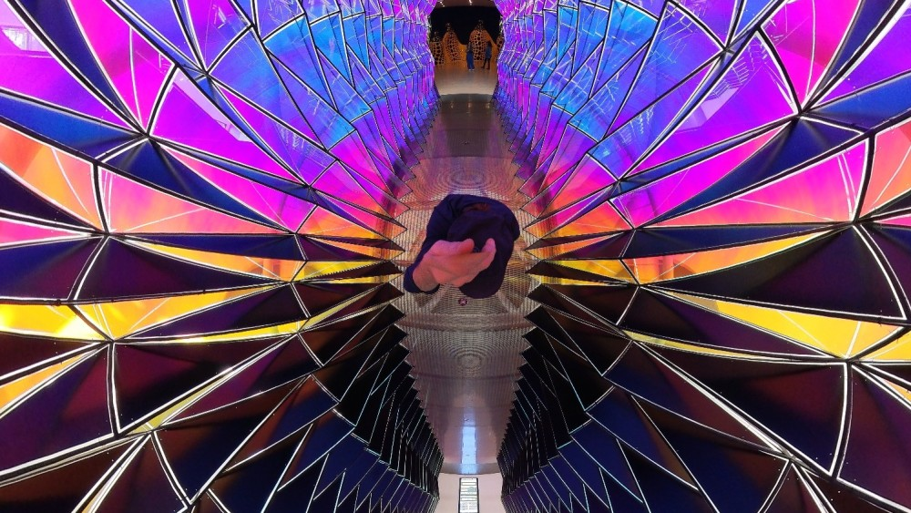

## Introduction

This textbook is written for the course [MUS2640 Sensing Sound and Music](https://www.uio.no/studier/emner/hf/imv/MUS2640/) at the University of Oslo, a foundation course for later studies in *music psychology* and *music technology*. You will be introduced to fundamental principles of acoustics, psychoacoustics, and perception. This includes knowledge about how sound is produced in instruments, reflected in space, and perceived by humans. This is the basis for how we experience pitch, timbre, harmony, and rhythm in music. You will also learn about computer-based representations of sound and music, and get an overview of digital audio, sound synthesis, and analysis. The course provides theoretical knowledge and practical skills for further studies of music psychology and technology.

:::{important} Learning Outcome
Having completed the course, you will:

- be familiar with principles of how musical sound is produced and perceived.
- understand relationships between sound-theoretical and music-theoretical concepts.
- be able to process, synthesise, and analyse sound.
:::

## Pedagogical Strategy

Students in the course typically have mixed backgrounds. Everyone usually has some musical background, ranging from classical performance on acoustic instruments to electronic studio production. Some come from musicology, others from psychology, informatics, media studies, philosophy, linguistics, medicine, and more. Everyone is welcome! In-class activities will be adjusted to cater to the collective knowledge and experience of the student group. 

### Active learning and "flipped classroom"

This course builds on the idea of [active learning](https://en.wikipedia.org/wiki/Active_learning), an approach that emphasises student engagement and participation in the learning process. Rather than passively receiving information through lectures, you are encouraged to interact with the material, ask questions, solve problems, and collaborate with peers. Activities may include group discussions, hands-on experiments, peer reviewing, and real-world projects. This method helps deepen understanding and develop critical thinking skills.

We also rely on a [flipped classroom](https://en.wikipedia.org/wiki/Flipped_classroom) approach, a teaching model in which traditional lecture content is delivered outside of class, typically through readings, videos, or interactive resources. This frees up classroom time to apply concepts through discussion, exercises, and collaborative work. This structure allows you to learn foundational material at your own pace and use class sessions for deeper exploration, clarification, and practical applications.

### A research-based and research-led course

This is a *research-based* course, meaning the content builds on new research results. All the teachers are active researchers and will bring in perspectives from ongoing projects. Much of this is based on scientific methods, but given the nature of the subject, we also include research that is design-centred or based in artistic practice. We will dwell on these differences at times, since understanding the different [epistemological](https://en.wikipedia.org/wiki/Epistemology) foundations for our knowledge production is important.

The course is also *research-led*, meaning that you will take part in ongoing research. This allows you to see how "real" research is conducted in practice. It is also valuable for the ongoing projects in the [Department of Musicology](https://www.hf.uio.no/imv/english/research/) and at [RITMO](https://www.uio.no/ritmo/english/). Although it is not required, you are encouraged to participate in research activities, contributing to ongoing projects, or initiating new ones. Such hands-on involvement helps bridge the gap between learning and research, inquiry and innovation.

### Open Education

The course material is developed from the perspective of [Open Education](https://en.wikipedia.org/wiki/Open_education), meaning that all material is freely and openly available. This approach ensures that you have unrestricted access to resources, enabling you to revisit and explore the material beyond the course duration. Open Education also promotes collaboration and sharing of knowledge within and outside the academic community. This is important for societal innovation and the legitimisation of ongoing research. 

Open Education aligns closely with the principles of [Open Research](https://en.wikipedia.org/wiki/Open_research), which emphasise transparency, accessibility, and reproducibility. In this course, we aim to integrate these principles by providing access to:

- **Open Publications**: Most of the required reading materials will be openly available, either entirely free ("free as in speech") or through institutional agreements ("free as in beer"). This means that there should be no economic barrier to attaining relevant knowledge.

- **Open Data**: Wherever possible, datasets used in the course will be openly shared. This allows you to analyse, visualise, and interpret data independently, fostering a deeper understanding of the material and encouraging reproducibility.

- **Open Source Code**: Tools, scripts, and examples provided during the course will be shared as open-source code. This enables you to study, modify, and build upon the code, promoting a hands-on approach to learning and encouraging contributions to the broader community.

By adopting these practices, the course not only supports your academic journey but also contributes to the global movement toward open and equitable access to knowledge. This approach empowers you to become an active participant in the creation and dissemination of knowledge, preparing you for future roles as researchers, educators, and innovators.

### Embracing AI

In this course, we will actively explore the use of [artificial intelligence](https://en.wikipedia.org/wiki/Artificial_intelligence) (AI), both to explore the course content and as a pedagogical tool. There are currently many AI tools available, yet they are underexplored in educational settings. We will try different tools and evaluate their effectiveness.

This textbook is an example of AI-based *co-creation*. Different large language models and the teachers have co-written it. However, the text has been undergoing human "peer review" to ensure everything makes sense. Throughout the course, we will explore when AI can safely be used for text generation and when it fails.

In this class, you are encouraged to explore AI for learning. AI-powered platforms can adapt content and feedback to individual learning styles and paces, helping you master concepts more effectively. However, AI-based tools should be used wisely; they are meant to support learning, not replace it. After all, the exam will be performed without any tools. Then you will need to think and write on your own!

## Tools

We will explore various tools throughout the semester. You will not learn any of these in detail, but you will see how they work and the applications for which they are suitable. These tools are designed to provide a broad overview of the possibilities in music technology and sound analysis.

<details>
<summary>PC Software</summary>

We will use the following software, most of which are free and/or open source. They are also cross-platform, meaning they work on Windows, macOS, and Linux.  

- **[Sonic Visualiser](https://www.sonicvisualiser.org/)**: A tool for viewing and analysing the contents of audio files. It allows you to visualise waveforms and spectrograms and to extract audio features.

- **[Audacity](https://www.audacityteam.org/)**: A widely used tool for recording, editing, and processing audio files, making it versatile for both beginners and advanced users in music and sound analysis.

- **[Python - Jupyter Notebook](https://jupyter.org/)**: An open-source web application that enables you to create and share documents containing live code, equations, visualisations, and narrative text.

- **[Pure Data (Pd)](https://puredata.info/)**: A visual programming language widely used for sound synthesis, audio processing, and interactive installations. It resembles the commercial software [Max](https://cycling74.com/products/max).

- **[Audiostellar](https://audiostellar.xyz/)**: A unique tool for exploring and organising sound samples using a visual interface. It helps you discover relationships between sounds and create new compositions.

- **[Freesound](https://freesound.org/)**: A collaborative online database of sound samples. It provides access to a wide range of sounds for music production, sound design, and research.

- **[moises.ai](https://moises.ai/)**: An AI-powered platform for music source separation and audio processing. It allows you to isolate vocals, instruments, and other elements from audio tracks.

- **[Maître Gnome](https://asym-co.de/)**: An experimental web-based tool for studying musical rhythms, including the ability to record tapping patterns for research applications.

</details>

<details>
<summary>Phone apps</summary>
We will use these free, cross-platform apps on both Android and iOS devices. 

- **[Noise Capture](https://noise-planet.org/noisecapture.html)**: A mobile app for recording, analysing, and reporting environmental noise. 

- **[SensorLogger](https://www.tszheichoi.com/sensorlogger)**: A mobile app for recording and visualising sensor data from your smartphone, such as accelerometer, gyroscope, magnetometer, and more. 
</details>

<details>
<summary>Hardware</summary>
We will explore these devices in class. You are not expected to purchase these yourself; they are available to borrow.

- **[LittleBits](https://littlebits.com/)**: A platform of modular electronic components that snap together to create interactive projects. It is a fun and creative way to explore sound synthesis and music-making.

- **[Ambisonics - Zoom H3-VR](https://zoomcorp.com/en/us/handheld-recorders/handheld-recorders/h3-vr-handy-recorder/)**: A portable recorder designed for capturing 360-degree spatial audio. It is ideal for creating immersive soundscapes and exploring 3D audio reproduction.

- **[OptiTrack Motion Capture](https://optitrack.com/)**: A high-precision, infrared, camera-based motion capture system used for tracking motion in 3D space.

- **[Equivital Life Monitors](https://www.equivital.com/)**: Wearable devices designed to monitor physiological data such as heart rate, respiration, and body temperature.

- **[PupilLabs Core](https://pupil-labs.com/products/core)**: Portable eye trackers that can be used for tracking where one looks while also capturing gaze and pupil size. 
</details>

## Curriculum

The current textbook comprises the core curriculum for this course. Interested readers can find more information in the texts listed below, as well as in the references section for each chapter.

<details>
<summary>Some short introduction books</summary>

- **[Music Psychology: A Very Short Introduction](https://doi.org/10.1093/actrade/9780190640156.001.0001)**: A concise introduction to the field of music psychology, exploring how music affects the mind and behaviour.

- **[Music and Technology: A Very Short Introduction](https://doi.org/10.1093/actrade/9780199946983.001.0001)**: An accessible overview of the relationship between music and technology, examining its impact on creation, performance, and listening.

- **[Ways of Listening: An Ecological Approach to the Perception of Musical Meaning](https://doi.org/10.1093/acprof:oso/9780195151947.001.0001)**: An introduction to how listeners perceive and interpret musical meaning in ecological contexts.

- **[Sound Actions: Conceptualizing Musical Instruments](https://doi.org/10.7551/mitpress/14220.001.0001)**: An examination of musical instruments as tools for interaction, creativity, and expression.
</details>

<details>
<summary>Some large reference works</summary>
Some books serve more as large-scale references of their respective fields:

- **[Handbook of Systematic Musicology](https://doi.org/10.1007/978-3-662-55004-5)**: A detailed reference for experimental and empirical approaches to the study of music.

- **[The Oxford Handbook of Music Psychology](https://doi.org/10.1093/oxfordhb/9780198722946.001.0001)**: A comprehensive overview of research and theories in music psychology.

- **[The Computer Music Tutorial, Second Edition](https://isbnsearch.org/isbn/9780262044912)**: *Curtis Roads* (2023), Cambridge: The MIT Press. A large volume covering all aspects of computer music, from sound synthesis to interaction.
</details>

<details>
<summary>Relevant Norwegian-language books</summary>
There are not many relevant books in Norwegian, but here are some:

- **[Musikkvitenskap: Introduksjon og Perspektiver](https://www.universitetsforlaget.no/musikkvitenskap-1)**: *Even Ruud* (2005), Oslo: Universitetsforlaget. An introductory Norwegian textbook covering key perspectives and approaches in musicology.

- **[Musikk og Bevegelse](https://alexarje.github.io/musikkogbevegelse/)**: *Alexander Refsum Jensenius* (2009), Oslo: Unipub. A Norwegian book exploring the relationship between music and movement.

- **[Lydlandskap: Om Bruk og Misbruk av Musikk](https://www.fagbokforlaget.no/Lydlandskap/I9788245000140)**: *Even Ruud* (2005), Bergen: Fagbokforlaget. A Norwegian book discussing the use and misuse of music in various contexts.
</details>


## Overview

This textbook is divided into chapters corresponding to each week's class.

```{tableofcontents}
```

## Learn more

::::{grid} 1 1 2 2
:::{card} MUS2133 Music Psychology
:link: https://www.uio.no/studier/emner/hf/imv/MUS2133/
This course explores the psychological aspects of music perception and cognition, including auditory perception, emotional responses to music, and the cognitive processes involved in musical activities such as listening, performing, and composing.
:::

:::{card} MUS2850 Computer Music
:link: https://www.uio.no/studier/emner/hf/imv/MUS2850/
This course delves into the intersection of music and technology, covering topics such as sound synthesis, digital audio processing, and algorithmic composition. Gain hands-on experience with tools and techniques used in creating and analysing music through computational methods.
:::
::::
