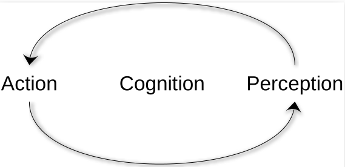

## Sensing Sound and music

This course is called "Sensing Sound and Music". But what does that mean? And what do those three words mean on their own?

```{admonition} Question
:class: question
Can you define the three terms "sensing", "sound", and "music"?
```

Sound and music are fundamental to human experience, serving as both a medium of communication and a form of artistic expression. *Sound* is a physical phenomenon characterized by vibrations that travel through a medium, while *music* is an organized arrangement of sounds that evoke emotional, cognitive, and cultural responses. Humans *sense* sound through our auditory system, but as we will discuss throughout the course, also through our bodies. Exactly how we "sense" music is still one of the core questions of both musicology at large and music psychology more specifically. It is also of interest in music technology.

Research in music psychology highlights how humans perceive and process sound, exploring topics such as pitch, rhythm, timbre, and harmony. Technological advancements, such as digital audio workstations and sound synthesis, have expanded the boundaries of music creation and analysis, enabling new forms of artistic exploration.

## An interdisciplinary approach

This course aims to be *interdisciplinary*, meaning that it draws on methods, theories, and perspectives from multiple academic fields to address complex questions about sound and music. Interdisciplinarity goes beyond simply combining knowledge from different areas; in this case, between musicology, psychology, and technology. The idea is that by approaching sound and music from these varied viewpoints, we gain a richer understanding of how humans perceive, experience, and create music, as well as how technology can enhance and transform these processes.

### Some etymology

[Etymology](https://en.wikipedia.org/wiki/Etymology) is the study of the origin and history of words and how their meanings and forms have changed over time. The word "etymology" is itself derived from the Ancient Greek words ἔτυμον (étymon), meaning 'true sense or sense of a truth', and the suffix -logia, denoting 'the study or logic of'. Similarly, we can investigate the three disciplines in question: 

- **Musicology**: The term "musicology" comes from the Greek words *mousikē* (music) and *-logia* (study or science). It is the scholarly study of music, covering its history, theory, and cultural context. Musicologists analyze how music is composed, performed, and understood across different societies and eras.

- **Psychology**: "Psychology" is derived from the Greek *psyche* (soul, mind) and *-logia* (study). It is the scientific study of the mind and behavior. In the context of music, psychology explores how people perceive, process, and respond to music emotionally and cognitively.

- **Technology**: The word "technology" originates from the Greek *techne* (art, craft, skill) and *-logia* (study). Technology refers to the tools, techniques, and systems humans create to solve problems or enhance capabilities. In music, technology includes instruments, recording devices, software, and other innovations that help create, analyze, or experience music.

```{admonition} Question
:class: question
Can you think of other words with a "logy" at the end? What do they mean?
```

By the end of the course, you will have learned some of the basic terminology, theories, and methods used in all these directions. 

### Differences between disciplinarities

When approaching different disciplines, it is important to understand how they interact. Many people call all sorts of collaboration between disciplines "interdisciplinarity". However, there are some differences, highlighted in this figure: 


Intradisciplinary work stays within a single discipline, while crossdisciplinary approaches view one discipline from the perspective of another. Multidisciplinary collaboration involves people from different disciplines working together, each drawing on their own expertise. Interdisciplinary work integrates knowledge and methods from multiple disciplines, synthesizing approaches for a deeper understanding. Transdisciplinary approaches go further, creating unified intellectual frameworks that transcend individual disciplinary boundaries.

One approach is not better than another, and many researchers combine their approach depending on the project type. Still, it is helpful to consider these differences as we approach each discipline and look at how they combine theories and methods. 

```{admonition} Question
:class: question
How do you define your own background in terms of disciplinarity?
```


### Concepts, theories, methods

An academic discipline is generally characterized by a distinct set of concepts, theories, and methods that guide inquiry and knowledge production within a particular field. Disciplines have established traditions, specialized terminology, and recognized standards for evaluating research and scholarship. They often possess dedicated journals, conferences, and professional organizations that foster communication and development among practitioners. The boundaries of a discipline are shaped by its historical evolution, core questions, and the types of problems it seeks to address, providing a framework for systematic study and advancement of understanding.

In our case, each of the three involved disciplines (musicology, psychology, and technology) brings its own theories and methods. Generally speaking, musicology uses analysis, historiography, and ethnography, psychology employs experiments and surveys, and technology relies on engineering and computational modeling. Understanding these differences helps clarify how interdisciplinary research can integrate diverse perspectives to enrich our knowledge of sound and music.

## Fundamentals of Music Psychology

Psychology in music focuses on understanding how humans perceive, process, and respond to sound and music. This includes exploring topics such as:

- **Perception**: How the brain interprets sound waves as musical elements like pitch, rhythm, and timbre.
- **Cognition**: The mental processes involved in understanding and remembering music, including pattern recognition and emotional responses.
- **Behavior**: How music influences actions, such as movement, performance, and social interaction.
- **Emotion**: The study of how music evokes feelings and moods, and its role in emotional regulation and expression.

These principles help us understand the universal and individual ways in which music impacts human experience, providing insights into both the psychological and cultural dimensions of music. In this course, we will primarily investigate perception, but also touch briefly upon cognition and behavior.

Music psychology is a thriving field internationally. There are numerous international communities, conferences, and journals for music psychology. These conferences provide excellent opportunities for networking, collaboration, and staying updated on the latest research.

<details>
<summary>Conferences and Communities in Music Psychology</summary>

- **[Neuromusic](https://www.neuromusicconference.org/)**: A conference dedicated to the intersection of neuroscience and music, exploring topics such as music perception, cognition, and therapy.
- **[ESCOM (European Society for the Cognitive Sciences of Music)](https://escom2021.org/)**: A society that organizes conferences and promotes research in the cognitive sciences of music.
- **[ICMPC (International Conference on Music Perception and Cognition)](https://icmpc.org/)**: A biennial conference that brings together researchers from around the world to discuss music perception and cognition.
- **[SMPC (Society for Music Perception and Cognition)](https://www.musicperception.org/)**: A society that hosts conferences and fosters research on the psychological and cognitive aspects of music.
- **[ICCMR (International Conference on Cognitive Musicology and Research)](https://www.iccmr.org/)**: A conference focusing on the intersection of cognitive science and musicology, exploring how humans understand and interact with music.
- **[Music and Neurosciences](https://www.fondazione-mariani.org/en/music-and-neurosciences/)**: A conference series exploring the relationship between music and brain function, organized by the Mariani Foundation.
</details>

<details>
<summary>Journals in Music Psychology</summary>

- **[Music Perception](https://online.ucpress.edu/mp)**: A leading journal that publishes research on the perception and cognition of music, including studies on auditory processing, musical memory, and emotional responses.
- **[Journal of New Music Research](https://www.tandfonline.com/toc/nnmr20/current)**: Explores the intersection of music psychology, technology, and theory, with an emphasis on computational and experimental approaches.
- **[Empirical Musicology Review](https://emusicology.org/)**: Publishes empirical studies on music perception, cognition, and performance, as well as reviews of current research.
- **[Psychology of Music](https://journals.sagepub.com/home/pom)**: Covers a wide range of topics in music psychology, including music education, therapy, and cultural studies.
- **[Frontiers in Psychology: Auditory Cognitive Neuroscience](https://www.frontiersin.org/journals/psychology/sections/auditory-cognitive-neuroscience)**: A section of the Frontiers in Psychology journal that focuses on auditory perception, music cognition, and related neuroscience.
- **[Music & Science](https://journals.sagepub.com/home/mns)**: An interdisciplinary journal that publishes research on the scientific study of music, including its psychological, cultural, and technological dimensions.
- **[Musicae Scientiae](https://journals.sagepub.com/home/msx)**: The journal of the European Society for the Cognitive Sciences of Music, publishing research on music psychology, cognition, perception, and interdisciplinary studies.
</details>

Given its interdisciplinary nature, researchers are typically working in either musicology or psychology departments, which also often "skews" the research in one or the other direction. Researchers on the musicology side tend to be more focused on real-world musical experiences, what is often termed "ecological validity," and using (more) qualitative methods. Researchers in psychology typically work more on controlled experiments and using quantitative methods.

While many researchers in music psychology may often feel "alone" in their respective departments, there are a few larger and specialized departments or research centers that focus on music psychology specifically. In these institutions, one can often see the width of the field, covering many different theoretical and methodological perspectives. 

## Fundamentals of Music Technology

Technology in music involves the use of tools and systems to create, analyze, and manipulate sound. Key areas include:

- **Sound Synthesis**: Generating sound electronically using techniques like additive, subtractive, and granular synthesis.
- **Digital Audio Processing**: Editing and transforming sound using software tools for tasks such as filtering, equalization, and effects.
- **Music Information Retrieval (MIR)**: Extracting meaningful information from audio data, such as tempo, key, and genre classification.
- **Interactive Systems**: Designing systems that respond to user input, enabling real-time music creation and performance.

These technologies expand the possibilities for music creation and analysis, offering new ways to explore and innovate within the field. There are also many international journals, communities, and annual conferences in music technology.

<details>
<summary>Conferences and Communities in Music Technology</summary>

- **[ICMC (International Computer Music Conference)](https://www.computermusic.org/)**: Focuses on computer music research, composition, and performance, bringing together artists, scientists, and technologists.
- **[SMC (Sound and Music Computing Conference)](https://smcnetwork.org/)**: Covers topics in sound and music computing, including audio analysis, synthesis, and interactive systems.
- **[NIME (New Interfaces for Musical Expression)](https://www.nime.org/)**: Explores new musical instruments and interfaces, emphasizing innovation in music performance and interaction.
- **[CMMR (Computer Music Multidisciplinary Research)](https://cmmr2023.sciencesconf.org/)**: Promotes multidisciplinary research in computer music, including psychology, acoustics, and engineering.
- **[ICAD (International Conference on Auditory Display)](https://icad.org/)**: Focuses on the use of sound to convey information, covering topics such as sonification and auditory interfaces.
- **[DAFx (Digital Audio Effects Conference)](https://www.dafx.de/)**: Dedicated to research on digital audio effects, signal processing, and music technology.
- **[ISMIR (International Society for Music Information Retrieval)](https://www.ismir.net/)**: Advances research in music information retrieval, including audio analysis, machine learning, and music data processing.
- **[AES (Audio Engineering Society)](https://www.aes.org/)**: An international organization for audio engineers, hosting conferences on sound recording, processing, and reproduction.
</details>

<details>
<summary>Journals in Music Technology</summary>

- **[Computer Music Journal](https://direct.mit.edu/comj)**: Focuses on digital audio, sound synthesis, and computer-assisted composition, providing insights into the intersection of music and technology.

- **[Journal of the Audio Engineering Society (JAES)](https://www.aes.org/journal/)**: Covers a wide range of topics in audio engineering, including sound recording, processing, and reproduction.

- **[Organised Sound](https://www.cambridge.org/core/journals/organised-sound)**: Explores the theory and practice of electroacoustic music and sound art, with an emphasis on innovative approaches.

- **[Journal of New Music Research](https://www.tandfonline.com/toc/nnmr20/current)**: Publishes research on music technology, computational musicology, and the development of new musical tools and systems.

- **[Leonardo Music Journal](https://www.leonardo.info/leonardo-music-journal)**: Focuses on the creative use of technology in music and sound art, highlighting experimental and interdisciplinary work.

- **[Frontiers in Digital Humanities: Digital Musicology](https://www.frontiersin.org/journals/digital-humanities/sections/digital-musicology)**: Explores the application of digital tools and methods to music analysis, composition, and performance.

- **[Transactions of the International Society for Music Information Retrieval (TISMIR)](https://transactions.ismir.net/)**: Publishes open-access research on music information retrieval, covering topics such as audio analysis, machine learning, and music data processing.
</details>

When comparing them, there are some important differences between music technology and music psychology as disciplines. Music psychology is primarily a *scientific* field of study, focused on understanding how humans perceive, process, and respond to music through empirical research and theoretical frameworks. Its methods are rooted in experimental design, data analysis, and psychological theory, aiming to uncover universal principles and individual variations in musical experience.

Music technology, on the other hand, spans several domains: science, art, design, and engineering. It encompasses scientific research into sound and audio processing, artistic exploration through composition and performance, design of musical instruments and interfaces, and engineering of hardware and software systems. Music technologists may work on developing new tools for music creation, analyzing audio signals, designing interactive installations, or exploring creative possibilities in digital media. This diversity means that music technology is not limited to scientific inquiry but also includes creative practice, technical innovation, and user-centered design.

Given its many directions, music technologists typically work in many different types of departments: computer science, electrical or mechanical engineering, design and art schools, as well as within musicology departments and music conservatories. As for psychologists, this institutional basis often also influences the directions taken. 

## Listening to the world

We will spend next week's class only on listening, but we will start with a little warm-up here. After all, listening is an essential human capacity and central to music. However, most people do not think much about listening in daily life, except for when it is annoying. Too low sound is difficult to hear what is said, and too low sound is unpleasant and even dangerous. But why is that, and how do we talk about it in precise terms? That is what we will explore both here and later in class. 

```{exercise}
Stand up. Close your eyes. Listen. What do you hear?
```

### Hearing vs listening

Let us start by considering the difference between hearing and listening. *Hearing* is the passive physiological process of detecting sound waves through the auditory system, while *listening* is an active cognitive process that involves interpreting and making meaning of those sounds.

In the psychology literature, you will probably find references to several different types of hearing and listening:

- **Passive hearing**: This occurs when sounds are registered by the ears and processed by the brain without conscious attention. For example, background noise in a café or the hum of an air conditioner.
- **Selective hearing**: The ability to focus on specific sounds or voices while ignoring others, such as following a conversation in a noisy environment.
- **Active listening**: Engaging attention and intention to understand, analyze, or respond to sounds or speech. This is essential in music appreciation, communication, and learning.
- **Critical listening**: Evaluating and analyzing sound quality, musical structure, or meaning, often used in music production, performance, or academic study.
- **Empathetic listening**: Focusing on the emotional content and intent behind sounds or speech, important in social interactions and therapeutic contexts.

It is important to note that the mechanisms underlying these different approaches to hearing and listening are still actively researched. So there are many&mdash;sometimes diverging&mdash;opinions about them, their differences, and how they overlap or connect. In any case, understanding these distinctions helps clarify how we interact with sound and music, moving from automatic sensory processing to deeper engagement and interpretation.

### Embodied music cognition

The approach to human psychology presented in this book is not neutral (not that any other book is that, either, even though they pretend to be). It is heavily based on a tradition called [*embodied music cognition*](https://en.wikipedia.org/wiki/Embodied_music_cognition), emphasizing the role of the body in musical experience. Although he did not invent the term, it became popularized after {cite}`leman_embodied_2008` wrote a book with the same name. 

Embodied music cognition was seen as radical at first but has become more mainstream over the years. Several researchers at the University of Oslo&mdash;with [Professor emeritus Rolf Inge Godøy](https://www.hf.uio.no/imv/english/people/aca/emeriti/rolfig/index.html) in front&mdash;have been active in developing this branch of research over the last decades. The approach has been foundational to the studies of music-related body motion in the [fourMs Lab](https://fourms.uio.no) and is also at the core of many activities at [RITMO Centre for Interdisciplinary Studies of Rhythm, Time and Motion](https://www.uio.no/ritmo/).

The core idea of embodied music cognition is that both the production and perception of music are based on integrating sensory, motor, and emotional dimensions. To paraphrase the father of ["ecological psychology"](https://en.wikipedia.org/wiki/Ecological_psychology), James Gibson, you explore the world with eyes in a head on a body that moves around. He was mainly interested in visual perception, but his ideas have inspired a similar thinking about other senses.

A different entry point to a similar idea is the concept of [*musicking*](https://en.wikipedia.org/wiki/Christopher_Small#Musicking). This term popularized by musicologist [Christopher Small](https://en.wikipedia.org/wiki/Christopher_Small), who argued that music is best understood as a verb&mdash;to music&mdash;not a noun {cite}`small_musicking_1998`. Music is not an object or a finished product (like a song or a score), but rather an activity&mdash;something people do. When a band plays a concert, the musicians, the dancers, the audience, the sound engineers, and even the people selling tickets and cleaning the hall are all engaged in musicking. The music exists not just in the notes played, but in the shared experience and interaction.

Researchers within embodied music cognition are eager to not only study "the music" but instead explore the complexity of musical interactions, from the role of gestures in musical performance to how perceivers synchronize their bodies to a musical beat. By engaging the body, embodied music cognition provides a holistic framework for studying how music is experienced and understood.

### Multimodality

*Multimodality* is a core feature of embodied music cognition and refers to the integration and interaction of multiple sensory modalities in the perception and understanding of the world. This table summarizes the main human senses, their associated sensory modalities, and the organs involved in each. 

| Sense         | Modality         | Human Organ(s)         |
|---------------|------------------|------------------------|
| Hearing       | Auditory         | Ears                   |
| Sight         | Visual           | Eyes                   |
| Touch         | Tactile          | Skin, Hands            |
| Taste         | Gustatory        | Tongue, Mouth          |
| Smell         | Olfactory        | Nose                   |
| Balance       | Vestibular       | Inner Ear              |
| Proprioception| Kinesthetic      | Muscles, Joints        |

From a psychological perspective, multimodality emphasizes how the brain combines information from these different sensory channels to create a cohesive and enriched experience. In the context of music cognition, this could involve the interplay between auditory and motor systems, such as how visual cues from a performer influence the perception of sound or how physical gestures enhance musical expression and understanding. However, the other senses are also involved. Touch provides tactile feedback for instrumentalists and singers; proprioception and balance help musicians coordinate movement and posture, especially in dance or performance; and even smell or taste can contribute to the emotional context and memory of musical events. These multisensory interactions enrich both performance and perception, deepening engagement for musicians and audiences alike.

Most people agree that sound is a core component of music, yet there are notable examples of musicians and composers who have created and performed music despite significant hearing loss. [Ludwig van Beethoven](https://en.wikipedia.org/wiki/Ludwig_van_Beethoven), one of the most influential composers in Western music history, continued to compose groundbreaking works even after becoming profoundly deaf. In more recent times, percussionist [Evelyn Glennie](https://en.wikipedia.org/wiki/Evelyn_Glennie) has demonstrated that musical experience and expression are not limited by the ability to hear sound in a conventional way. Glennie, who lost most of her hearing by the age of twelve, developed unique techniques to sense vibrations through her body, allowing her to perform and interpret music at the highest level. These examples challenge traditional notions of music as purely an auditory phenomenon and highlight the importance of multimodal and embodied approaches to musical experience.

<div style="max-width:1024px"><div style="position:relative;height:0;padding-bottom:56.25%"><iframe src="https://embed.ted.com/talks/evelyn_glennie_how_to_truly_listen?autoplay=false" width="1024px" height="576px" title="How to truly listen" style="position:absolute;left:0;top:0;width:100%;height:100%" frameborder="0" scrolling="no" allowfullscreen onload="window.parent.postMessage('iframeLoaded', 'https://embed.ted.com')"></iframe></div></div>


### Action and Perception

The last concept we will introduce this week is the *action–perception loop*. The idea of embodied cognition in general is that we sense through action, and act through sensing. In music, the action-perception loop is evident in activities such as playing an instrument, where sensory feedback informs motor actions, and vice versa. For example, a pianist adjusts their touch based on the sound produced, creating a continuous cycle of interaction.



[Eric Clarke](https://en.wikipedia.org/wiki/Eric_Clarke) has used the action–perception loop as core to his thinking about *ecological listening*. He bridges psychology, musicology, and acoustic ecology, offering insights into how humans engage with sound as part of their lived experience. In his influential book *Ways of Listening*, he argues for three different listening modes: 

- **Direct perception**: Listeners perceive sounds in relation to their environment without needing extensive cognitive processing.
- **Affordances**: Sounds provide cues about actions or interactions possible within a given environment.
- **Contextual listening**: The meaning of sounds is shaped by their environmental and situational context.

As we will see next week, there are many similar ways of thinking about how we listen. 


## Questions

1. What are the main differences between musicology, psychology, and technology as academic disciplines?
2. How can interdisciplinarity enhance our understanding of sound and music compared to single-discipline approaches?
3. What is the distinction between hearing and listening, and why does it matter when studying music?
4. How does embodied music cognition explain relationships between physical motion and musical experiences?
5. What is the action-perception loop, and how does it manifest in musical activities?

```{bibliography}
```
