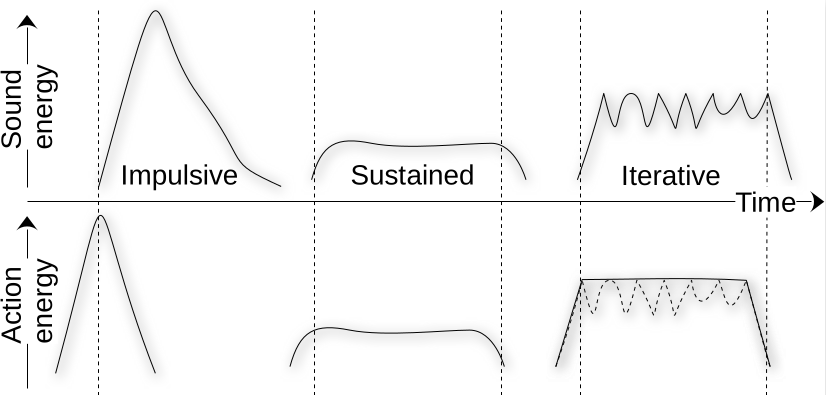

## Describing sounds

Recall last week's discussion about the differences between hearing and listening. We will get back to the mechanisms for both hearing in the coming weeks&mdash;focusing on both the acoustic and psychoacoustic parts&mdash;but this week will focus on how we listen, what we listen to, and how we can describe the sound and reflect on its meaning.

```{exercise} Listen with closed and open eyes
1. Find a suitable location.
2. Stand still for two minutes with your eyes closed.
3. Listen attentively to the environment.
4. Open your eyes and stand still for another two minutes.
5. Listen attentively to the environment.
6. Reflect on what you heard. Did it change after opening the eyes?
```

### Many approaches to describing sounds

Academic approaches to describing sound vary across the three main directions we are considering in this course (musicology, psychology, and technology). They each tap into various subfields (or paradigms), each offering distinct frameworks and terminologies:

- **[Acoustics](https://en.wikipedia.org/wiki/Acoustics)**: Focuses on the physical properties of sound waves, such as frequency, amplitude, duration, and propagation in different media.  
	*Example*: An acoustician might describe a clap in a concert hall as "a broadband impulse with a peak amplitude of 85 dB SPL, followed by a reverberation decay time of 1.8 seconds," using measurements and graphs to illustrate how sound behaves in the space.

- **[Psychoacoustics](https://en.wikipedia.org/wiki/Psychoacoustics)**: Investigates how humans perceive sound, using quantitative measures (frequency, loudness, spatial location) and perceptual attributes (brightness, roughness).  
	*Example*: A psychoacoustic study might report that "a 1000 Hz tone at 60 dB SPL is perceived as moderately loud and bright," and compare listener responses to tones with varying roughness or spatial placement.

- **[Music theory](https://en.wikipedia.org/wiki/Music_theory)**: Focuses on musical parameters (pitch, rhythm, timbre, dynamics) and cultural context.  
	*Example*: A musicologist might describe a violin tone as "a slightly sharp C, with a bright timbre, starting from pianissimo and with a gradual crescendo," using musical notation to visualize it on paper.

- **[Spectromorphology](https://en.wikipedia.org/wiki/Spectromorphology)**: This specialized form of music theory analyzes the spectral (frequency) and morphological (shape and evolution) characteristics of sounds.  
	*Example*: A spectromorphological analysis could describe a cymbal crash as "an impulsive onset followed by a complex, evolving spectrum that decays over several seconds," visualized with a spectrogram showing frequency content over time.

All of these descriptions focus specifically on describing the sound "itself" or how we *hear* it. There are also several (slightly overlapping) approaches to studying the effects of sound on people or environments: 

- **[Sound Studies](https://en.wikipedia.org/wiki/Sound_studies)**: An interdisciplinary field that examines sound as a cultural, social, and material phenomenon. Sound studies draw from media studies, anthropology, history, and philosophy to explore how sound shapes and is shaped by society, technology, and everyday life.  
	*Example*: A sound studies scholar might analyze how urban noise regulations reflect social attitudes toward public space, or investigate the role of sound in shaping collective memory and identity.

- **[Acoustic Ecology](https://en.wikipedia.org/wiki/Acoustic_ecology)**: Emphasizes environmental context, categorizing sounds as keynote, signal, or soundmark. Soundscapes are described in terms of their ecological function and impact.  
	*Example*: An acoustic ecologist could document a city park by noting "birdsong as a keynote, a distant siren as a signal, and the hourly chime of a church bell as a soundmark," analyzing how each sound shapes the experience of the space.

- **[Ethnography](https://en.wikipedia.org/wiki/Ethnography)**: This subbranch of [anthropology](https://en.wikipedia.org/wiki/Anthropology) uses qualitative methods such as interviews, field notes, and participatory observation to describe how communities interact with and interpret their sonic environments.  
	*Example*: An ethnographer might record that "local residents describe the evening call to prayer as calming and unifying," supplementing this with field notes and interviews about its social significance.

- **[Linguistics](https://en.wikipedia.org/wiki/Linguistics) and [Semiotics](https://en.wikipedia.org/wiki/Semiotics)**: Examines the meaning and communicative function of sounds, including onomatopoeia, prosody, and sound symbolism.  
	*Example*: A linguist could analyze the word "buzz" as onomatopoeic, noting how its sound mimics the noise of a bee, or study how rising intonation in speech signals a question.

There is no right or wrong when it comes to studying sound. All of these approaches (and more) aim to uncover various aspects of both the physical properties of sounds but also their meaning, context, and impact on listeners. Several of them are also used in various combinations. We won't have time to cover all of these in detail in this course, but we will look more closely at some of the closest ones to the fields of music psychology and technology. This week, we will focus on two main concepts that have been influential in the development of our understanding of listening: *soundscapes* and *sound objects*.


## Soundscapes

A *[soundscape](https://en.wikipedia.org/wiki/Soundscape)* refers to the acoustic environment as perceived or experienced by people, encompassing all the sounds that arise from both natural and human-made sources. Describing soundscapes involves several dimensions:

- **Physical Properties**: Documenting the types of sounds present (e.g., birdsong, traffic, water), their frequency ranges, loudness, and temporal patterns.
- **Ecological Function**: Identifying the roles sounds play in the environment, such as signaling, masking, or providing information about ecological health.
- **Spatial Characteristics**: Noting how sounds are distributed in space: directionality, distance, and reverberation within the environment.
- **Perceptual Attributes**: Describing how listeners experience the soundscape: pleasantness, annoyance, tranquility, or stimulation.

A comprehensive description of a soundscape often combines "objective" measurements, such as sound level measurements and field recordings, that can be used to make spectrograms with annotated sound maps and written descriptions to capture and analyze soundscapes. Together, these objective measurements, subjective impressions, and contextual information provide a holistic understanding of the sonic environment.

```{note} 
The distinction between "objectivity" and "subjectivity" in research is complex and debated. It is important to note that the so-called objective approaches (relying on recording and measurements) are always based on context and subjective choices. Similarly, subjective note-taking and interpretation can be systematized to reduce bias. In contemporary research, we try to use multi-method approaches that combine perspectives from the "qualitative" and "quantitative" directions. Integrating both perspectives provides a richer, more nuanced understanding of soundscapes, acknowledging that scientific inquiry into sound must balance measurement with meaning.
```


### R. Murray Schafer and Acoustic Ecology
[R. Murray Schafer](https://en.wikipedia.org/wiki/R._Murray_Schafer) (1933–2021) was one of the pioneers of soundscape studies. He was to propose and define *[soundscape](https://en.wikipedia.org/wiki/Soundscape)* as the acoustic environment as perceived by humans. Starting from the 1960s, he led the [World Soundscape Project](https://en.wikipedia.org/wiki/World_Soundscape_Project) at Simon Fraser University in Canada, a groundbreaking research initiative focused on studying, documenting, and analyzing the sonic environments of various locations. Through this work, Schafer and his team developed new methods for field recording, sound mapping, and acoustic analysis, aiming to understand how sounds shape our experience of place and community.

Schafer's most famous book is *[The Tuning of the World](https://www.google.no/books/edition/The_Soundscape/-FsoDwAAQBAJ?hl=no&gbpv=0)* {cite}`schaferSoundscapeOurSonic1977`, which introduced key concepts for analyzing soundscapes:

- **Keynote sounds**: These are background sounds that are fundamental to a particular environment, often heard unconsciously. Examples include the hum of traffic in a city or the rustling of leaves in a forest. Keynotes set the acoustic context but are not usually the focus of attention.

- **Signals**: Signals are foreground sounds that are listened to consciously because they carry specific information or meaning. Examples include a ringing phone, a siren, or a bird call. Signals stand out from the background and often prompt a response or action.

- **Soundmarks**: Soundmarks are unique or characteristic sounds that are especially valued by a community or location, similar to landmarks in the visual environment. Examples might be the chimes of a local church bell, a distinctive factory whistle, or a waterfall. Soundmarks help define the identity of a place and are often preserved or celebrated.

Schafer's work laid the foundation for the field of [acoustic ecology](https://en.wikipedia.org/wiki/Acoustic_ecology) and inspired similar projects worldwide, encouraging interdisciplinary collaboration between musicians, scientists, urban planners, and environmentalists. The project advocated for the preservation of valuable soundscapes and raised awareness about the impact of noise pollution and urbanization on our acoustic environment. It also inspired the [World Forum for Acoustic Ecology (WFAE) Conference](https://www.wfae.net/), an international gathering bringing together researchers, artists, educators, and practitioners to explore the relationship between humans and their sonic environments.

Schafer also introduced the term [schizophonia](https://en.wikipedia.org/wiki/Schizophonia) to describe the separation of a sound from its source, often through recording technology. For example, when you hear a bird song played from a speaker, the sound is no longer coming from the bird itself, but from a device. This separation can change how we experience and relate to sounds, sometimes making them feel less "authentic" or connected to their natural context.


### Hildegard Westerkamp and Soundwalking

[Hildegard Westerkamp](https://en.wikipedia.org/wiki/Hildegard_Westerkamp) (1946–) worked with Schafer in the World Soundscape Project and is famous for developing the concept of [soundwalking](https://en.wikipedia.org/wiki/Soundwalking) as a reflective practice of walking and listening to the environment. This is not only a practice of listening but also a method of engaging with the environment in a mindful and reflective way. It encourages participants to become aware of the acoustic ecology of their surroundings, fostering a deeper connection to place and community. Soundwalking can be used as a tool for artistic inspiration, environmental awareness, and even therapeutic purposes. 

Key aspects of soundwalking include:

- **Active Listening**: Paying close attention to the layers of sound in the environment, from the most prominent to the subtle.
- **Contextual Awareness**: Understanding how sounds interact with the physical and social context of a space.
- **Documentation**: Participants may choose to record sounds, take notes, or create maps to capture their auditory experience.

Hildegard Westerkamp’s soundwalking practice bridges both scientific research and artistic exploration. In her scientific work, Westerkamp used soundwalks as a method for gathering data about urban and natural soundscapes. Participants documented their listening experiences, helping researchers analyze acoustic environments, identify sources of noise pollution, and understand how people perceive and interact with their sonic surroundings. These soundwalks contributed to studies in acoustic ecology, urban planning, and environmental psychology.

Artistically, Westerkamp transformed soundwalking into a creative process. She composed works based on field recordings and reflections gathered during soundwalks, such as her acclaimed piece *[Kits Beach Soundwalk](https://www.youtube.com/watch?v=hg96nU6ltLk)*. Her compositions often blend environmental sounds with narration, inviting listeners to experience places through attentive listening. Westerkamp’s approach encourages audiences to engage with everyday sounds as musical material, blurring the boundaries between scientific observation and artistic expression.

Through soundwalking, Westerkamp demonstrated how attentive listening can deepen our understanding of environments, foster community awareness, and inspire new forms of sonic art.


```{exercise} Sound Walking
1. Walk slowly in a group, without talking 
2. Stop whenever you hear something interesting 
3. Write a note on why you stopped and what was interesting
```

### Steven Feld and Acoustemology

[Steven Feld](https://en.wikipedia.org/wiki/Steven_Feld) (1949–) is an American anthropologist and ethnomusicologist known for his pioneering work on the relationship between sound, culture, and perception. Feld introduced the concept of *[acoustemology](https://en.wikipedia.org/wiki/Acoustemology)* as a blend of "acoustics" and "epistemology" to describe how knowledge and experience are shaped through sound and listening.

Acoustemology emphasizes that listening is not just a sensory act but a way of knowing and engaging with the world. Feld’s research, particularly with the Kaluli people of Papua New Guinea, demonstrates how sound is deeply embedded in social life, memory, and identity. He explored how environmental sounds, music, and language are interconnected, and how communities use sound to make sense of their surroundings.

Key aspects of acoustemology include:

- **Sound as Knowledge**: Understanding that sound is a primary medium for learning, communicating, and relating to place.
- **Cultural Listening**: Recognizing that listening practices are shaped by cultural context, history, and environment.
- **Sonic Identity**: Investigating how communities define themselves and their spaces through distinctive soundscapes and musical traditions.

Feld’s work encourages researchers and listeners to consider how sound shapes experience and meaning, and how listening can be a method for understanding both local and global cultures.


## Sound objects

After having considered soundscapes more broadly, let us "zoom in" and investigate specific [sound objects](https://en.wikipedia.org/wiki/Sound_object) in more detail. The development of this concept came before that of soundscapes, emerging from a French "school" of composers and theorists.

### Pierre Schaeffer and the Sound Object

The concept of sound object was proposed by the French composer and musicologist [Pierre Schaeffer](https://en.wikipedia.org/wiki/Pierre_Schaeffer) (1910–1995). He is renowned for pioneering [musique concrète](https://en.wikipedia.org/wiki/Musique_concr%C3%A8te), a form of electroacoustic music that uses recorded sounds as raw material. Throughout his work, Schaeffer laid the foundation for modern sound design, electronic music, and auditory research, influencing generations of composers and sound theorists.

The sound object&mdash;*l'objet sonore* in French&mdash;is at the core of Schaeffer's theoretical work. His argument was that when listening to sound, we do not hear the continuous sound, but that our perception is grouped into a series of separate sound objects with specific properties. When we perceive speech, we hear words, not single phonemes. When we hear music, we hear tones and short phrases that fuse into "chunks" of sound, typically in the range of 0.5 to 5 seconds.

Schaeffer also introduced the idea of *reduced listening* as a way to focus on the intrinsic qualities of sound *itself* rather than its source (sound-producing objects and actions) or semantic meaning. This includes a sound's texture, tone, and dynamics. 

Through reduced listening, Schaeffer developed a large *[spectromorphology](https://en.wikipedia.org/wiki/Spectromorphology)* that can be used to describe any type of sound. We will not go into the whole system, but instead look at the general characterization of sound objects. He suggested three core types:

- **Impulsive**: Short, percussive sounds (e.g., a click or a drum hit).
- **Sustained**: Continuous sounds with steady qualities (e.g., a drone or a held note).
- **Iterative**: Rapidly repeating sounds (e.g., a tremolo or a rattling noise).

The categories are coarse, but this model can still be helpful for describing the general shape of sound objects. 



Schaeffer's thoughts have inspired numerous theorists and composers to date. He is often considered the "father" of [electroacoustic music](https://en.wikipedia.org/wiki/Electroacoustic_music), music that incorporates electronic technology for the production, manipulation, and reproduction of sound. It often involves recorded sounds, synthesis, and digital processing, allowing composers to explore new sonic possibilities beyond traditional instruments.

Schaeffer's focus on reduced listening has also inspired a specific type of electroacoustic music called [acousmatic music](https://en.wikipedia.org/wiki/Acousmatic_music), where sound is heard without seeing its originating cause. Acousmatic music, often presented through "loudspeaker orchestras" in dark concert settings, emphasizes the experience of sound itself rather than its source.

### Expanding Schaeffer’s thinking

Several theorists have built upon Pierre Schaeffer’s foundational ideas about sound objects and listening:

- **[Dennis Smalley](https://en.wikipedia.org/wiki/Denis_Smalley)** (1946–, University of London) formalized the concept of *spectromorphology*, providing a comprehensive vocabulary for describing the spectral and morphological evolution of sounds. Smalley’s approach is widely used in electroacoustic music analysis and has helped clarify how listeners perceive the shape and transformation of sound objects over time.

- **[Lasse Thoresen](https://en.wikipedia.org/wiki/Lasse_Thoresen)** (1949–, Norwegian Academy of Music) has expanded spectromorphological analysis, creating practical frameworks for describing and notating sound objects in both electroacoustic and acoustic music. Thoresen’s work bridges theory and practice, making Schaeffer’s taxonomy accessible for composers and analysts.

- **[Rolf Inge Godøy](https://www.hf.uio.no/imv/english/people/aca/emeriti/rolfig/index.html)** (1955–, University of Oslo) has advanced Schaeffer’s concepts by developing detailed models for how listeners perceive and mentally represent sound objects. Godøy’s work emphasizes *gestural-sonorous objects*, linking sound perception to physical gestures and movement, and has contributed to the field of *embodied music cognition* and *morphological analysis*.

- **[Michel Chion](https://en.wikipedia.org/wiki/Michel_Chion)** (1947–) has introduced the concept of *synchresis* to describe the perceptual phenomenon where a sound and a visual event are perceived as occurring simultaneously, even if they are artificially synchronized. This concept is central to audiovisual theory, as it highlights the human tendency to create a cohesive relationship between what is seen and heard. Synchresis plays a crucial role in film sound design, where it is used to enhance the emotional and narrative impact of scenes by aligning specific sounds with visual actions, regardless of their actual source or origin.


## Artistic explorations

As the overview above has shown, the developments of soundscape and sound object theory have been developed by people that identify both as artistic and scientific researchers, producing both artistic and scientific results This may be uncommon in some fields, but within sound and music, theoretical development can be seen as coming out of artistic practice, and the artistic practice has been inspired by the theoretical development. Here, we will look at some influential works that have been part of the same development. 

### John Cage and 4'33''

[John Cage](https://en.wikipedia.org/wiki/John_Cage) (1912–1992) was an American composer and music theorist whose work challenged traditional notions of sound and music. One of his most influential and controversial pieces is *[4'33''](https://en.wikipedia.org/wiki/4%E2%80%B233%E2%80%B3)*, composed in 1952. The piece consists of three movements, during which performers are instructed not to play their instruments. Instead, the focus shifts to the ambient sounds of the environment, making the audience's listening experience the central element of the composition. Cage's work emphasizes the idea that silence is never truly silent. The piece invites listeners to engage deeply with the sounds around them, blurring the line between music and environmental noise. *4'33''* is a seminal work in experimental music, influencing fields such as sound art, acoustic ecology, and contemporary composition.

<iframe width="560" height="315" src="https://www.youtube.com/embed/JTEFKFiXSx4?si=Bh0A0SZ8V2OprjTs" title="YouTube video player" frameborder="0" allow="accelerometer; autoplay; clipboard-write; encrypted-media; gyroscope; picture-in-picture; web-share" referrerpolicy="strict-origin-when-cross-origin" allowfullscreen></iframe>

### Pauline Oliveros and Deep Listening

[Pauline Oliveros](https://en.wikipedia.org/wiki/Pauline_Oliveros) (1932–2016) created the [Deep Listening](https://en.wikipedia.org/wiki/Deep_Listening) practice, emphasizing *sonic awareness* as heightened attention to sound and its context. Her *Sonic Meditations* is a collection of text-based instructions (1971) guiding groups in listening and sound-making exercises, fostering communal awareness and creativity. *[Bye Bye Butterfly](https://www.youtube.com/watch?v=DMCTxkFwLHw)* (1965) was an early electronic composition blending live feedback and tape delay, reflecting on the transformation of sound and memory. 

Throughout her long career, Oliveros made numerous performances exploring acoustic space and group interaction. Oliveros’s work encourages active, inclusive listening and has influenced contemporary sound art, music therapy, and community music practices.

<iframe width="560" height="315" src="https://www.youtube.com/embed/_QHfOuRrJB8?si=LfxTPI1GcmhLwbrI" title="YouTube video player" frameborder="0" allow="accelerometer; autoplay; clipboard-write; encrypted-media; gyroscope; picture-in-picture; web-share" referrerpolicy="strict-origin-when-cross-origin" allowfullscreen></iframe>

### Yoko Ono and Experimental Listening

[Yoko Ono](https://en.wikipedia.org/wiki/Yoko_Ono) (1933–) is a pioneering artist and composer whose work often challenges conventional boundaries between sound, performance, and audience participation. Her influential *Instruction Pieces*, such as those in *Grapefruit* (1964), invite listeners and performers to engage with sound and silence in imaginative, conceptual ways. Ono’s approach emphasizes the creative act of listening, encouraging audiences to perceive everyday sounds as art and to reflect on the relationship between sound, environment, and intention. Her work has inspired generations of artists to explore listening as an active, transformative practice.

### Alvin Lucier and "I am sitting in a room"

[Alvin Lucier](https://en.wikipedia.org/wiki/Alvin_Lucier) (1931–2021) was an American composer known for his experimental works exploring acoustic phenomena and the perception of sound. His iconic piece, *[I am sitting in a room](https://en.wikipedia.org/wiki/I_Am_Sitting_in_a_Room)* (1969), is a landmark in sound art and acoustic ecology. In this work, Lucier records himself reading a text describing the process: he is sitting in a room, recording his voice, and repeatedly plays back and rerecords the tape. With each iteration, the resonant frequencies of the room reinforce themselves, gradually transforming the speech into pure tones shaped by the space’s acoustics. Eventually, the words become unintelligible, replaced by the unique sonic fingerprint of the room.

<iframe width="560" height="315" src="https://www.youtube.com/embed/fAxHlLK3Oyk?si=quatI_I4Vrcz5BA_" title="YouTube video player" frameborder="0" allow="accelerometer; autoplay; clipboard-write; encrypted-media; gyroscope; picture-in-picture; web-share" referrerpolicy="strict-origin-when-cross-origin" allowfullscreen></iframe>

*I am sitting in a room* demonstrates how environments shape sound and listening. It invites reflection on the relationship between technology, space, and perception, and is widely cited in discussions of sound art, acoustic ecology, and experimental music.

### Norwegian artists and practitioners

Norway has a vibrant community of artists and researchers working with soundscapes, listening practices, acoustic ecology, and electroacoustic composition:

- **[Britt Pernille Frøholm](https://www.brittpernillefroholm.no/)** (1974–): Composer and performer exploring acoustic ecology and soundscape composition in Norwegian landscapes.
- **[Espen Sommer Eide](https://www.sommer-eide.net/)** (1972–): Artist and musician working with field recordings, sound installations, and listening walks.
- **[Jana Winderen](https://www.janawinderen.com/)** (1965–): Sound artist whose field recordings and installations focus on underwater and natural sound environments.
- **[Maja S. K. Ratkje](https://ratkje.no/)** (1973–): Composer and performer integrating environmental sounds and experimental listening in her works.
- **[Natasha Barrett](https://www.natashabarrett.org/)** (1972–): Composer and sound artist specializing in spatial audio, immersive sound installations, and electroacoustic composition, with a focus on environmental listening.

These practitioners have contributed to both artistic and academic developments in the field, often collaborating across disciplines to deepen our understanding of sound and listening in Norwegian contexts.


## Capturing sound

Let us conclude this week by summarizing how we can capture and represent sound in different ways. This can include written descriptions, visual representations, and audio recordings. Each approach offers unique insights into the qualities and context of sounds.

### Writing about sound

Writing about sound is a way to translate auditory experiences into language. This can involve:

- **Descriptive writing**: Use adjectives and metaphors to convey the character of sounds (e.g., "a shimmering, metallic clang" or "a gentle, rhythmic hum").
- **Contextual notes**: Record the time, location, and circumstances in which the sound occurred.
- **Reflective journaling**: Capture your emotional or sensory response to the sound, noting how it affected your mood or perception.
- **Analytical writing**: Break down the sound into its components (e.g., pitch, rhythm, timbre, dynamics) and discuss its structure or function.

Writing helps clarify your listening experience and can be used for research, creative projects, or personal reflection.

### Drawing sounds

Drawing sounds is a creative way to visualize sonic phenomena. Techniques include:

- **Waveform sketches**: Represent the amplitude and shape of a sound over time.
- **Spectrogram drawings**: Illustrate the frequency content and evolution of a sound.
- **Symbolic notation**: Use shapes, lines, and colors to depict qualities like loudness, pitch, or texture.
- **Sound maps**: Create diagrams showing the spatial distribution of sounds in an environment.

Visual representations can reveal patterns and relationships that are difficult to express in words and are useful in both artistic and scientific contexts.

### Recording sounds

Recording sounds is the most direct way to capture and preserve sonic events. Key points include:

- **Equipment**: Use microphones and recording devices suited to your environment and purpose (e.g., handheld recorders for fieldwork, studio microphones for controlled settings).
- **Technique**: Pay attention to microphone placement, levels, and background noise to ensure clear recordings.
- **Documentation**: Keep notes about the recording context, including date, time, location, and any relevant observations.
- **Archiving and sharing**: Organize recordings for future use and consider sharing them on platforms like Freesound.org for collaborative projects.

Audio recordings allow for detailed analysis, creative manipulation, and sharing of soundscapes and sonic objects with others.

```{exercise} Record soundscapes
1. Turn on a sound recording device (e.g., mobile phone) 
2. Walk slowly while listening attentively
3. Listen to your recording and compare it to what you heard while walking
4. Share your sound recording with reflections on [Freesound.org](https://freesound.org/)
```

```{bibliography}
```
## Questions

1. What are the main differences between describing sounds using acoustics, psychoacoustics, and music theory?
2. Explain the concepts of keynote sounds, signals, and soundmarks as defined by R. Murray Schafer.
3. What is the practice of soundwalking, and how did Hildegard Westerkamp contribute to its development?
4. Describe Pierre Schaeffer’s concept of the sound object and the three core types he identified.
5. How do artistic practices such as John Cage’s 4'33'' and Pauline Oliveros’s Deep Listening challenge traditional approaches to listening and sound?
