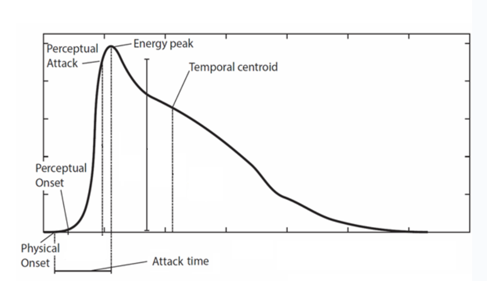
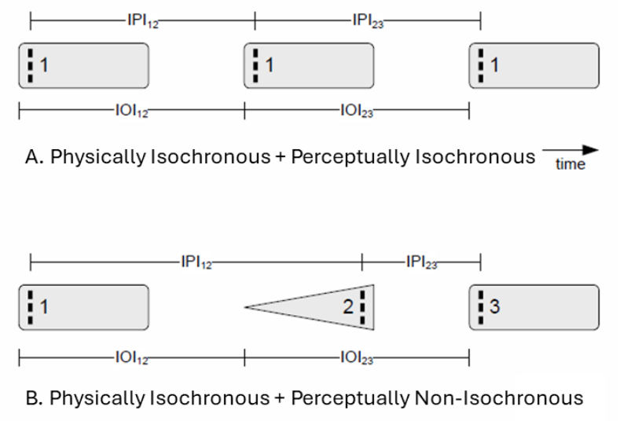
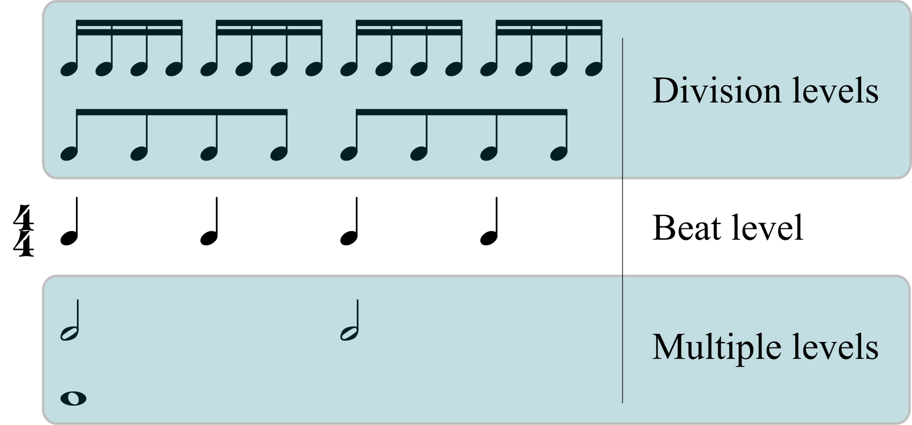
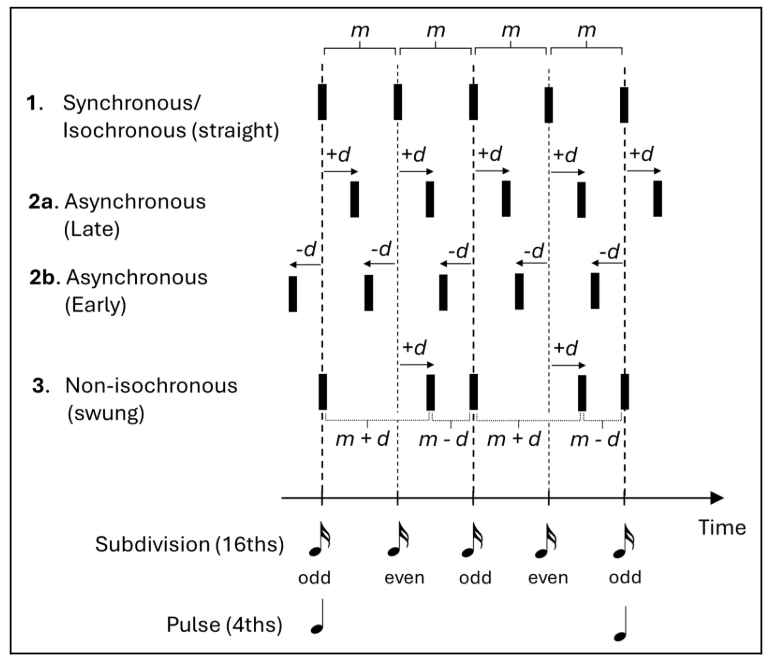
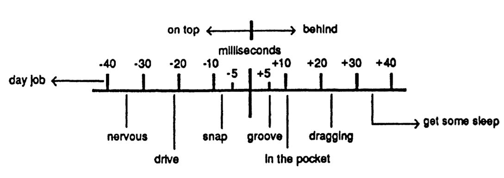

## Introduction

Music unfolds in time. Unlike pitch or timbre, which can be considered
at a single point in time, rhythm and meter depend on duration, order,
and recurrence. They provide the structures that allow us to predict,
move, and coordinate.

In this chapter, we begin with broad concepts of time and rhythm before
considering the frameworks of meter, pulse, and subdivisions. We then
explore microrhythmic nuance and the phenomenon of groove as it pertains
to rhythmic structures.

Throughout, you will see that musical time is not only a matter of clock
measurement. It is shaped by perception, culture, and performance
practice. Rhythms and meters may be notated on the page, but their feel
depends on how musicians and listeners interpret and embody them.

## Time

Time in music refers to the organization of sounds and silences in a
temporal framework. It is the foundation upon which rhythm, beat, and
meter are built.

### Onset Timing

When we speak of the "timing" of instruments in performance, it usually
refer to the *onset timing* more specifically. When analysing the sound
signals of rhythms (e.g., waveform analysis), the (physical) onset
represents the moment a sound "begins" usually defined as the moment the
signal rises above a certain amplitude threshold (zero dB or noise floor
baseline), or begins to rise with a slope above a certain pre-determined
value. Various onset-detection algorithms exist, and each can differ
slightly, though the principle remains the same.

In addition to physical onset, sound events have other relevant
timing-related features such as:

- **Perceptual Onset**: the earliest a sound is perceived to begin

- **Perceptual Attack** or **Center**: the "perceived moment of rhythmic placement"

- **Energy Peak**: the highest peak of energy or intensity

- **Attack Time** (or Duration): time from Physical Onset to Energy Peak

- **Temporal Centroid**: the temporal "balancing point" of the sound



*Image source: adapted from Nymoen et al. (2017)[^1]*

### Perceptual Center (P-center) - Perceptual Attack Time (PAT)

When listening to rhythms, the "moment of occurrence" of a sound—the point we use to place it in time—often does not coincide with its physical onset. This percept is often called the *perceptual center* (P-center) or *perceived attack time* (PAT): a subjective reference point that typically falls somewhere after physical onset and before the peak of the sound's energy. As a result, sequences that are physically synchronous or physically isochronous may be heard as misaligned or uneven.

Studies show that certain sound parameters affect where P-centers are heard. Attack Duration or Time (time from onset to peak) is the strongest factor: *faster attacks* yield *earlier* P-centers; *slower attacks* yield *later* ones. Total duration (from onset to offset) exerts a weaker but similar influence—shorter sounds shift P-centers earlier; longer sounds shift them later.


*Image Source: Guilherme Schmidt Camara 2025 ©*

Take two guitar chords for example, one played by slowly arpeggiating the strings ("*swept*") and one playing fast by stroking all the strings in quick succession ("*swift*"). Although both are produced by the same instrument, the swept stroke will tend to sound as if occurring slightly later relative to its physical onset compared to the swift stroke, where the P-center will tend to be much closer to its onset timing.


*Image source: adapted from Câmara et al. (2020)[^2]*

Taken altogether, this means aligning tracks by physical onsets does not always guarantee perceptual synchrony in a rhythmic sequence. When two identical sounds are *physically synchronous* (physical onsets evenly spaced) and their P-centers closely align with their physical onsets, they will tend to sound *perceptually isochronous* (example A). However, when different sounds with different attack duration profiles are physically isochronous but their P-centers *do not* closely align with their physical onsets, then they will tend to sound *perceptually non-isochronous* (example B). An analogous case can be imagined with sounds that occur simultaneously in a vertical fashion instead: if their P-centers are similar, they will tend to sound more *synchronous*, if P-centers are misaligned, more *asynchronous*.



*Image source: adapted from Villing, R. C. (2010)[^3]. Note: IPI = Inter-P-Center-Interval, IOI\] = Inter-Onset-Interval*

## Rhythm

A rhythm can be considered a pattern of durations. When a series of sound events occur, the intervals between them form recognizable shapes in time. In everyday use, we often call anything regular "rhythmic," but in music the term usually refers more specifically to a *pattern of durations formed by intervals between the perceived time points of notes*.

Rhythms can be *periodic* (based on cycles, such as a march rhythm) or *aperiodic* (irregular, as in speech or improvisation). Both can be meaningful: a drum groove in 4/4 and a free jazz solo may each have rhythm, but in different senses.

Rhythms also have cultural meanings. A clave rhythm in Afro-Cuban music is more than a sequence of durations—it is a structural reference for musicians and dancers. Similarly, speech rhythms shape the flow of rap and spoken word performance.

## Meter

Meter provides a *hierarchical framework* for the organization rhythm. It is often described as a nested system of pulses at multiple periodicities, from fast subdivisions to slower bar lengths:

- **Beat** **(Pulse/Tactus)**: the fundamental beat to which we tend to synchronize/entrain to

- **Division levels**: subdivisions of the beat, 8ths, 16ths, 32nds, and slower groupings.

- **Multiple levels**: slower groupings of the beat, half-notes, bar-lengths etc.



*Image Source: [Wikipedia - Meter (music)](https://en.wikipedia.org/wiki/Metre_(music))*

### Pulse / Beat

The *beat* (often also referred to as the *tactus* or *pulse*) is the basic time unit of a meter. A pulse can also describe an ongoing stream of beats (one can speak of 8th note pulses just as much as quarter note pulses). Regardless, the beat level of music is what we naturally tap our feet to, providing stability and predictability for performers and listeners alike.

Research suggests that we comfortably perceive and move to beats when their IOI rate lies between about 500-700ms (120-86 BPM). Pulse is thus closely tied to our sensorimotor system—we tend to move along with it. Faster events are heard as subdivisions, and slower ones are grouped into larger spans.

In performance, the pulse may not always be physically marked by sound. Even when silent, it can be inferred as a virtual reference that organizes events. Musicians often "feel" the pulse even when they play around it.

### Subdivision

Subdivisions divide each beat into smaller units. Perceptually, subdivisions tend to be heard when their IOI duration is between ca. 100 to 500 milliseconds. Subdivisions provide detail and density, and often act as stylistic markers (e.g., straight eighths in rock; sixteenths in funk; triplet-based 12/8 in blues).

### Metric Accent

Traditionally, Western theory frames meter as a pattern of strong and weak accented beats (e.g., ONE-two-THREE-four in 4/4). Accents are thought to align where metrical levels overlap. But in practice, this is not always how music is felt or performed. Many groove-based styles emphasize *off-beat positions*. In many popular genres such as rock, soul, and r&b, the snare back-beats on 2 and 4 may feel more salient than beat 1. In reggae, the offbeats on the "ands" may dominate more than the downbeats. This is to show that metrical accents are not fixed but can be redefined by practice and cultural convention.

### Asymmetric Meter

Not all meters divide evenly into twos (binary) and threes (tertiary). *Asymmetric meters* (such as 5/8 or 7/8) feature beats of different durations, organized into uneven groupings of equal subdivisions, like 3+2 or 2+2+3. They are common in Balkan, Middle Eastern, and contemporary art music traditions.

Performers often feel such meters as cycles of unequal steps rather than a uniform grid. The asymmetry can produce a sense of lilt or forward drive distinct from even meters.

In addition, the *inter-onset-interval* (*IOI*), or time duration, between the main beats in a meter may either be isochronous (equal), or non-isochronous (unequal). In many popular groove-based styles, instruments tend to create a highly isochronous beat structure. In Scandinavian folk styles such as Telespringar, the main beats of the meter are not always equal in duration, but instead can vary (e.g, long-medium-short), creating a signature lilting feeling to the music.

```{exercise}
:label: exercise-nonisochrony-tapping
:topic: Meter, Non-Isochrony, Entrainment

Listen to an excerpt of a *springar* fiddle tune by Jon Vestafe (**Audio Ex. 1** – the first beat is marked by a synthetic voice for three measures to help you entrain to the beat). Can you hear how the beats are irregular (non-isochronous)? Compare this to John Coltrane's *My Favorite Things* (**Audio Ex. 2**), where the beats are highly regular.

Now try tapping to both using the *Maître Gnome* online tapping platform:
- First, tap along to [*My Favorite Things*](https://asym-co.de/tap3a/).
- Then, tap along to [*springar*](https://asym-co.de/tap3b/).

After tapping at least 3 full bars in each, follow the instructions at the bottom of the page (copy/paste the saved dump code into the right field in the provided Google form link). The group results will be discussed in class.

**Reflect:** Compared to just listening, how did it feel to try and tap to the beat? Was it easier to perceive the non-isochrony in the *springar*? Briefly describe your experience.
```

## Audio Source Separation

Audio source separation is the process of extracting individual sound sources (e. g., a single flute) from a mixture of sounds (e. g., a recording of an entire concert band) utilizing a variety of computational techniques that consider various features in the extraction process (rhythm, pitch, harmony, notational score). It is a highly useful tool for analysis of rhythm and timing, making detection of onsets microrhythm far easier today than a decade ago.


*Image Source:* Manilow et al. (2020)[^4]

A range of audio source separation tools are available, each with unique advantages and trade-offs:

- **Commercial Online Tools** (e.g., moises.ai, lalal.ai)  
  - *Strengths*: Fast, cloud-based processing with intuitive, DAW-like interfaces. These services typically provide high-quality separation for common instruments in Western popular music, making them accessible to non-experts and suitable for most general use cases.
  - *Limitations*: User control over separation parameters is limited, as algorithms are proprietary and not user-adjustable. Free versions often restrict export quality or the number of processed tracks, while full functionality usually requires a paid subscription.

- **Open Source / Code-Based Tools** (e.g., Spleeter by Deezer, Demucs)  
  - *Strengths*: Highly customizable—users can tweak parameters, retrain models for specific instruments or genres, and integrate separation into research or custom workflows. These tools are free and adaptable for advanced or specialized needs.
  - *Limitations*: Processing speed and quality depend on local hardware and configuration. They require technical skills (command-line or programming experience), and achieving optimal results may involve additional setup or parameter tuning.

Choosing the right tool depends on your technical background, the complexity of your separation task, and whether you prioritize ease of use or customization.


```{exercise}
:label: exercise-source-separation-moises
:topic: Audio Source Separation, Analysis, moises.ai

Sign up for a free account at [moises.ai](http://moises.ai). Upload a track of your choice (preferably something groove-based, or with at least drums and a few other rhythm instruments). Listen to the individual stems produced by the source separation.

- Do you notice any distortions, glitches, or loss of frequency information in the separated stems?
- Reflect on how useful such a separation would be for transcription or signal analysis purposes (both rhythm and pitch).
- Consider the limitations of current source separation algorithms and how they might affect your analysis.

**Reflect:** How did the quality of the separated stems compare to your expectations? In what ways could these tools assist or hinder your musical analysis?
```

## Microrhythm

*Microrhythm* refers to fine-scale timing and shaping of events around our subjective reference structures (beat, subdivision). Unlike beat and subdivision-level rhythms, microrhythm concerns variations in timing at a scale below 100 ms.

In terms of timing, one can speak generally of two related, yet different forms of microrhythm: *asynchrony* and *non*-*isochrony*. Asychrony relates to how musicians can play in an either more synchronized ("on-beat") or asynchronous (early/"pushed" or late/"laid-back") fashion relative to each other. Non-isochrony relates to how they might skew the durational ratio of metrical subdivision levels (e.g., 8th or 16th notes) to varying degrees from isochronous ('straight') to non-isochronous ('swung').

Whereas asynchrony and non-isochrony both denote departure in timing from synchrony and isochrony in rhythmic contexts (Figure 1, example 1), they do so along different dimensions: asynchrony refers to vertical non-alignment between simultaneously sounding events, whereas non-isochrony denotes non-equal horizontal timing relationships between successive events.



*Image Source*:* [Câmara et al. (2025)](https://doi.org/10.31234/osf.io/jsg94_v1)*, Figure 1*[^5]*

Asynchrony tends to be measured as the absolute positive (late) or negative (early) value of signal *onset displacement* (*d*) relative to a fixed timing reference grid (often isochronous) in milliseconds (example 2a and 2b below). Swing is commonly quantified in two ways: either as simply the absolute onset displacement (d) from a grid of an even-numbered/off-beat subdivision event (in milliseconds), or as the '*swing ratio*' (R) between the relative duration of an odd-numbered subdivision event (m + d) and a subsequent even subdivision (m − d), where m is the mean inter-onset-interval (IOI) rate of the subdivision level (example 3). Swing ratios are thus calculated by the formula: 𝑅 = 𝑚 + 𝑑 / 𝑚 − 𝑑, and may be expressed as a ratio (e.g., 1.5:1 \['medium swing'\]) or more simply as a decimal (e.g., 1.5).

Overall, microrhythm can include both *expressive* moment-to-moment nuance and *systematic* patterns that recur across a piece or style. In many musical performance traditions, those systematic patterns often constitute the *norm* themselves, rather than representing "*deviations*" from ideal or perfect metronomic/isochronous timing.

### Asynchrony: Beat Delay / Anticipation

Musicians may sometimes play *behind or ahead of the beat* in a *systematic* fashion—whether consciously or not. In rock and soul styles, snare drum strokes on beats 2 and 4 of a 4/4 meter are often claimed to be delayed, and in funk, downbeats are said to regularly anticipate "One". It's important to remember that what counts as "late" or "early" depends on a reference in any given context—whether kick, snare, or overall grid.

Different degrees of *beat delay/anticipation* are said to convey different types of '*feels*'. For example, delayed (late) back-beats in groove-styles are often described as \"*Laid-back*\", and elicit a more \"relaxed" feel when only slightly delayed, but a "heavy" or "dragging" feel if delayed too much. Anticipated (early) beats on the other hand are regularly described as "*On-top/Pushed*", which at lower magnitudes might sound "snappy" and "driving", but too much may sound "nervous" or "rushing". Many scholars and musicians have attempted to develop their own heuristics as to what is the right degree of asynchrony in a given style. For example MIDI-based electronic music producer Michael Stewart\'s (in Prögler 1995) \"feel spectrum,\" which illustrates his prescriptions for an assortment of rhythmic feels at 130 beats per minute, for use with synthesizers and drum machines:



*Image Source: adapted from Stewart (in Prögler 1995)[^6]*

We can look at an example where Bootsy Collins (bassist from James Brown Band and Parliament-Funkadelic) is playing[^7] along to a highly isochronous drum machine groove, which serves as a convenient stable time reference to measure bass onset asynchronies against (listen to **Audio Ex. 3**, where the 2-bar bass and drum riff is looped 3 times). An onset timing analysis reveals that Bootsy systematically plays slightly behind the beat at around +15 ms on average (dashed white line in plot)—what Stewart might call "in the pocket" playing), and furthermore, he does so in the same systematic way in both bars (red and blue lines).


*Image Source: Guilherme Schmidt Camara 2025 ©*

```{exercise}
:label: exercise-asynchrony-tapping
:topic: Asynchrony, Beat Delay/Anticipation, Groove

Listen to an excerpt of D'Angelo's *Left and Right* (**Audio Ex. 4**). Can you hear any systematic delay or anticipation in the comp section? Does it sound "snappy"/"driving", or "dragging"/"heavy"? Now listen to an excerpt from James Brown's *Get Up Offa That Thang* (**Audio Ex. 5**). Do you hear any asynchronies here?

Now try tapping to both tracks using the *Maître Gnome* online tapping platform:
- First, tap along to [*Get Up Offa That Thang*](https://asym-co.de/tap4a/).
- Then, tap along to [*Left and Right*](https://asym-co.de/tap4b/).

After tapping at least 3 full bars for each, follow the instructions at the bottom of the page (copy/paste the saved dump code into the right field in the provided Google form link). The group results will be discussed in class.

**Reflect:** Compared to just listening, how did it feel to tap along to the beat? Did it change how the groove felt? Did you perceive the asynchronies more or less the same?
```

### Non-Isochrony: Swing

The duration of subdivision notes need not be isochronous (equal) such as in a straight 8ths hi-hat pattern in rock. Swing - a form of "non-isochrony (non-equal durations) describes systematic long--short patterns at the subdivision level.

In jazz, musicians typically do not swing at a perfectly mechanical 'triplet swing' ratio of 2:1, but rather swing ratios in performance can vary from closer to 1:1 (straight) all the way up to 3:1 (dotted swing) and beyond depending on tempo, sub-genre, and personal style amongst other factors. In funk/hip-hop, on the other hand, sixteenth-notes tend to be swung at more subtle degrees (e.g., 1.2:1) unless played in explicit funk-shuffle styles (closer to 2:1, triplet).

Different swing ratios are thought to impart different degrees of "motional energy" to rhythms. Rhythms with lower swing ratios (closer to 1:1) are described as more "continuous" "driving", or "propulsive", whereas higher swing ratios (up to 2:1 and beyond) tend to impart "bounce" to "choppiness", often accentuating the downbeats/on-beats of the meter.

Looking at Bootsy Collins' performance again, instead of simply measuring how early or late the timing of bass onsets are on every note, we can calculate the swing ratio between all pairs of odd- and even-numbered subdivisions. We find that the bass swings rather significantly (mean: 1.4) over the course of the two bars, sometimes swinging more and sometimes less—arguably supplying the groove with a certain degree of "bounce". Again, the swing pattern is applied systematically across both bars. (**Audio Ex. 6** gives the bass pattern isolated, without drum machine, looped 3 times).


*Image Source: Guilherme Schmidt Camara 2025 ©*


```{exercise}
:label: exercise-swing-perception
:topic: Swing, Isochrony, Triplet Quantization

Listen to two manipulated versions of James Brown's *Get Up (I Feel Like Being a Sex Machine)*, where the vocals have been source separated out:

- In **Audio Ex. 7**, the timing of all instruments has been modified to be perfectly aligned with a straight 16th grid (1:1 - isochronous).
- In **Audio Ex. 8**, the timing is perfectly aligned with a triplet sixteenth grid (2:1 - quantized triplet swing).

**Reflect:** Does one version feel more "choppy" and the other more "driving/continuous"? Why might this be the case?

Finally, listen to the original version (**Audio Ex. 9**, no timing manipulation). Can you tell which instruments are swinging, and if so, are they swinging to the same degree?
```

### Perceptual Thresholds of Microrhythm

The just-noticeable difference (JND) thresholds of asynchrony and non-isochrony—the smallest change in onset timing that a listener can reliably detect—depends on various factors. In general, however, asynchrony JNDs tend to depend strongly on instrument attacks and texture. With overlapping, sustained or blended tones (e.g., piano, strings, winds, voices), listeners typically need onsets to differ by roughly 20--50 ms before they hear them as asynchronous. In groove contexts that often involve sharper, more transient sounds (e.g. drums, picked bass), smaller onset displacements can be detected, around 10--20 ms for trained musicians.

As for swing JND thresholds, non-musicians tend to need around 30 ms (ca. 1.4) to hear rhythms as irregular (not straight/isochronous), while trained musicians can detect lower degrees of swing at around 10 ms displacement (about 1.1 - 1.2).

Other contextual factors can affect the extent to which we hear microrhythmic nuances. In general, the faster the tempo, the greater the onset displacement magnitude, and more displaced events (higher note density) as well as musical training all improve sensitivity.

For more on JNDs of microrhythm in music, see [Câmara et al. (2025)](https://doi.org/10.31234/osf.io/jsg94_v1)[^8]


```{exercise}
:label: exercise-onset-detection-sonicvisualiser
:topic: Onset Detection, Audio Analysis, Sonic Visualiser

Download and install [Sonic Visualiser](https://www.sonicvisualiser.org/download.html), a free tool for visualizing and analyzing audio files. Also download and install the [Vamp Plugin Pack](https://www.vamp-plugins.org/pack.html).

Open sound files of separate instruments from the same track (such as those you source-separated in Exercise 2) and experiment with marking onsets onto the waveforms:

- Load one instrument audio file into Sonic Visualiser first (File → Open), then load the other instrument audio files using File → Import More Audio.
- Select an instrument layer pane, and then run, for example, the BBC onset plugin:
    - Transform → Analysis by Maker → BBC → Rhythm: Onset
- Tweak sensitivity (especially threshold), then Run (press OK).
    - Re-run with different threshold/sensitivity if it over/under-detects onsets; keep only the best layer (right-click layer name → Remove Layer) to avoid clutter.
- Do the same for other instrument stems.
- (Optional) To measure timing differences elsewhere, select a layer and File → Export Annotation Layer... to TSV/CSV. You can then compute inter-onset intervals or between-layer offsets in a spreadsheet.

**Reflect:** Do you notice asynchronies between different instrument layers (e.g., bass to drums), or systematic patterns of swing in the subdivisions of a given instrument? Are they steady or random?
```

## Entrainment

[Entrainment](https://en.wikipedia.org/wiki/Entrainment_(biomusicology)) refers to the synchronization of an individual's movements or internal rhythms with an external rhythm, such as a musical beat.

Meter can be thought of as a *musically specific form of entrainment*: we synchronize our attention (and often our movements) to periodicities in the sound. This synchronization sets up *periodic peaks of attention*—expectancy moments where events are most salient—and these peaks are arranged in *hierarchies* (subdivision, tactus/beat, bar, larger cycles). In this view, meter is less a printed grid and more a *behavior of attention* that locks to temporal invariants and shapes how we group notes and hear accents.

*Dynamic attending* theory attempts to explain where metrical accent "comes from" from a cognitive perspective. Not all accents are metrical: phenomenal accents (loudness, timbre, leaps) and structural accents (harmonic/melodic goals) can occur anywhere. *Metrical accent*, however, is said to arise when a rhythmic event lands *inside an attentional peak*—that is, it is *marked by consciousness*, not just made louder. Thus a rock backbeat (dynamic emphasis on 2 and 4) need not move the metrical accent away from 1 and 3 for enculturated listeners; the listener's entrainment maintains the meter while reading the backbeat as an idiomatic reinforcement.


Think of metrical accent strength as the *height and narrowness of an attention peak*. Stronger regularity and clearer cueing tighten the window for "on-time," while looser surfaces widen it without losing the beat.

## Groove

While groove can be understood in many ways, here we can focus on groove as "pattern" and as "performance approach", with focus on aspects of time and rhythm.

As pattern, a groove can be simply defined as a persistently repeated rhythm—often spanning one or two bars—whose events establish a clear beat and a characteristic subdivision layer. The beat may be externalized (e.g., kick/snare backbeat in 4/4) or implied by cyclic "isoperiodic" figures that recur in a predictable fashion. Style identity often hinges on the *basic unit* (the smallest repeating chunk) and its *density referent* (the shortest practically used subdivision).

As performance, a groove is the coordinated realization of that basic unit across parts (e.g., drums, bass, guitar/keys, vocals). Players distribute roles: some layers re-inforce the beat (e.g. kicks on beats 1 and 3, snare on 2 and 4), while others supply tension by playing on off-beat subdivisions (e.g., bass accentuating the '2-and'). Often, grooves balance stability (easily entrainable pulse) with off-beat rhythmic devices that supply interest and complexity such as syncopation and cross-/counter-rhythm (see below).

### Syncopation

Syncopation is often described as a local contradiction of a metrical expectation scheme: a note occurring on a weak-position accent, a tie across a strong beat, or the omission of a strong beat followed by sound on a weak one. In 4/4, common cases include stressing the "and" of 2 or 4, tying into 1, or placing a salient event on 3-and while 3 itself is silent. Because the beat is usually firmly established in groove styles, such contradictions tend to add *tension* without destabilizing the meter.

Syncopation can arguably also *reinforce* meter—when an expected strong beat is left unarticulated, listeners feel the "missing" beat more vividly through anticipation; the follow-up weak-beat event then locks back to the underlying cycle. Backbeat-heavy styles illustrate this: dynamic accents on 2 and 4 do not move the downbeat to 2; instead, they clarify a beat-level 'hocketing' against the strong--weak--strong--weak scheme.

Once again, using Bootsy Collins' bass performance as an example (bar 1 of the two-bar transcribed pattern below), looking at a simpler riff this time (**Audio Ex. 10**), we can see that he plays almost exclusively on the off-beat positions of the meter, hitting mainly the "-a" and "'-and" notes (think: 1-e-and-a, 2-e-and-a, etc.) with the exception of the "One"—a typical trait in funk music, where the downbeat is clearly marked in every repetition of the basic groove unit. Against the drums—which, conversely, are highly anchored to the main beats, featuring no syncopation on the 8th and 16th note subdivision level—the bass provides ample tension and rhythmic interest, without challenging the meter.


*Image Source: Guilherme Schmidt Camara 2025 ©*

### Counter-/Cross-Rhythm

When syncopated events recur *systematically* within the basic unit, they may form larger scale, patterned off-beat groupings that suggest alternative periodicities to the main beat.

[Cross-rhythm](https://en.wikipedia.org/wiki/Cross-beat) (often also called "polyrhythm") occurs when these groupings display a systematic overlap of rhythmic streams whose periodicities (i.e. 'metrical levels') are noninteger multiples. Typical examples in 4/4 meter would be when two evenly spaced events are superimposed over three beats (2:3 cross-rhythms) or four events over three or six beats (4:3 or 4:6 crossrhythms). The regular pattern of overlapping accents regularly contradict the beats of the prevailing meter, challenging it and engendering greater metrical ambiguity—to the extent that one might hear the pulse as either binary or triplet.


*Image Source: Guilherme Schmidt Camara 2025 ©*

In most groove styles, however, such overlapping rhythms are usually *bounded*—they tend to span less than a bar, and usually coincide again with beat-confirming positions of the meter before repeating. As such they tend to generate lesser degrees of metrical ambiguity without fundamentally challenging the main pulse. Typical counter-rhythmic groupings in 4/4 are 3+3+2 over eight eighth notes, or 3+3+3+3+2+2 over sixteen sixteenths; listeners may hear secondary "pulses" riding on top of the main meter.


*Image Source: Guilherme Schmidt Camara 2025 ©*

Once again, returning to the more complex Bootsy Collins riff we saw earlier, this time, what appears on the surface to be a dense pattern with many 16th notes could be construed as roughly accenting a typical counter-rhythm often found in groove-based music: a 3-3-2 (repeated twice) (see below for transcription, and listen to **Audio Ex. 11**, where the counter-rhythm is overlaid by a clave). Although this counter-rhythm produces constant 2:3 cross-rhythms, they never fully create the sense of a triplet pulse above the main binary 4/4 beat, as the bass groove always returns to accent the main meter beats before this happens.


*Image Source: Guilherme Schmidt Camara 2025 ©*


```{exercise}
:label: exercise-syncopation-crossrhythm
:topic: Syncopation, Cross-Rhythm, Groove Analysis

Listen to the chorus of Jackie Wilson's *Your Love Keeps Lifting Me (Higher and Higher)* (**Audio Ex. 12**, see transcription below).

- Identify which notes in the melody or accompaniment are syncopated (i.e., placed on weak beats or off-beats).
- Listen for instruments that accentuate cross- or counter-rhythmic figures. Can you detect any grouping patterns (such as 3+3+2)?
- Note where and how the instruments reassert the main beats of the meter.


**Reflect:** How do syncopation and cross-rhythms contribute to the groove? Does the reassertion of the main beats help maintain a sense of meter despite rhythmic complexity?
```

## Tempo

[Tempo](<https://en.wikipedia.org/wiki/Tempo)>) is the rate of a given pulse, usually measured in BPM as the pulse rate of the fundamental metrical level (e.g. quarter notes in 4/4).

### Spontaneous Tempo

Without a reference, people tend to tap within a *spontaneous tempo range* (around 100--120 BPM). This overlaps with walking pace and many dance genres. It suggests that musical tempo is linked to bodily rhythms.

### Tap BPM

A common way to find tempo is simply tapping along to the beat. Tap-BPM tools convert this into a BPM value. Small tempo differences can affect how swing feels—at slower tempos, uneven subdivisions are easier to hear as "swing," while at faster tempos they collapse into straight feel.


## **Questions**

1.  Define rhythm and meter. each in one sentence. Give a musical example where phenomenal accents contradict the notated metrical accents—and explain why the meter still "holds."

2.  Why do researchers measure onset timing rather than P-centers when analyzing performances?

3.  Why do many listeners move most comfortably to beats with IOIs around 500--700 ms (≈120--86 BPM)? What typically happens to beat perception above and below this range?

4.  A snare with a very sharp attack and a bass note with a slower attack strike together at the same physical onset time. Why might they not sound synchronous? Name two sound features that can shift perceived placement.

5.  How do straight and swung subdivisions differ? Describe with words and numbers.

6.  Explain laid-back and pushed timing. Why does the choice of reference layer matter?

7.  What is entertainment, and how does it explain that we can maintain a sense of a steady pulse despite microrhythmic variations?

8.  What makes a groove "work"? Explain how a stable beat and subdivision interact with off-beat devices (syncopation, counter-/cross-rhythm, swing) and performance choices to create feel.


[^1]: Kristian Nymoen, Anne Danielsen & Justin London (2017). Validating Attack Phase Descriptors Obtained by the Timbre Toolbox and MIRtoolbox, In Tapio Lokki; Jukka Pätynen & Vesa Välimäki (ed.), Proceedings of the 14th Sound and Music Computing Conference 2017. Aalto University. ISBN 978-952-60-3729-5, s 214 - 219

[^2]: Câmara, G. S., Nymoen K., Lartillot O., and Danielsen, A. (2020). Effects of instructed timing on electric guitar and bass sound in groove performance. Journal of the Acoustical Society of America 147(2), 1028--1041

[^3]: Villing, R. C. (2010). Hearing the moment: Measures and models of the perceptual centre. Ph.D. dissertation, National University of Ireland.

[^4]: Manilow, E., Seetharman, P., & Salamon, J. (2020, October). *Open source tools & data for music source separation*. [https://source-separation.github.io/tutorial](https://source-separation.github.io/tutorial?utm_source=chatgpt.com)

[^5]: Câmara, G. S., Spiech, C., Solli, S., Bang, B., Rogulina, O., Laeng, B., & Danielsen, A. (2025, September 1). Just Noticeable Difference Thresholds of Asynchrony and Non-isochrony in a Multi-Instrumental Groove-based Context. [https://doi.org/10.31234/osf.io/jsg94_v1](https://doi.org/10.31234/osf.io/jsg94_v1)

[^6]: Prögler , J. A. (1995). Searching for swing: Participatory discrepancies in the jazz rhythm section. *Ethnomusicology*, 39, 21-54. DOI: 10.2307/852199

[^7]: Dancing in the Street, episode 9, "Make It Funky" (BBC/WBGH, 1996)

[^8]: Câmara, G. S., Spiech, C., Solli, S., Bang, B., Rogulina, O., Laeng, B., & Danielsen, A. (2025, September 1). Just Noticeable Difference Thresholds of Asynchrony and Non-isochrony in a Multi-Instrumental Groove-based Context. [https://doi.org/10.31234/osf.io/jsg94_v1](https://doi.org/10.31234/osf.io/jsg94_v1)