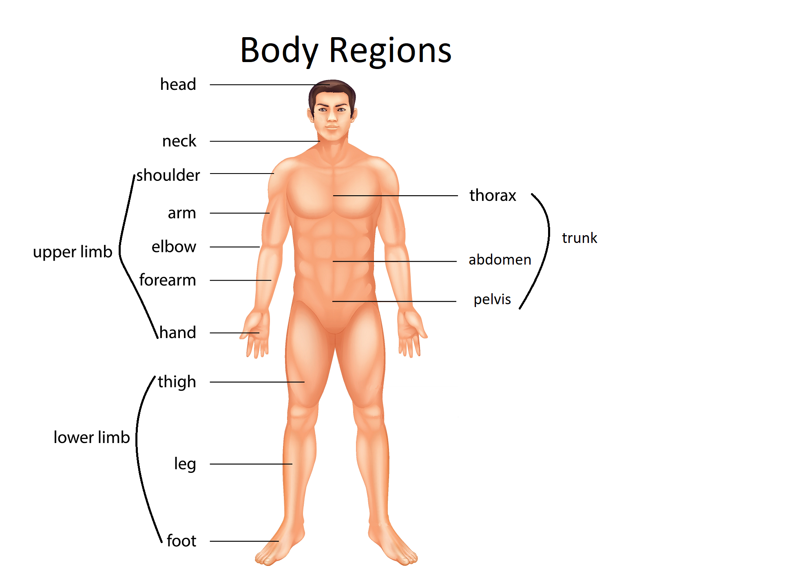
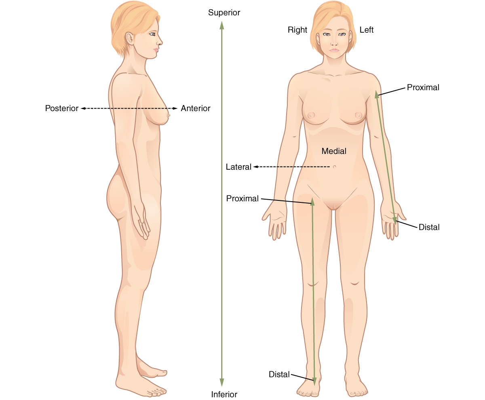
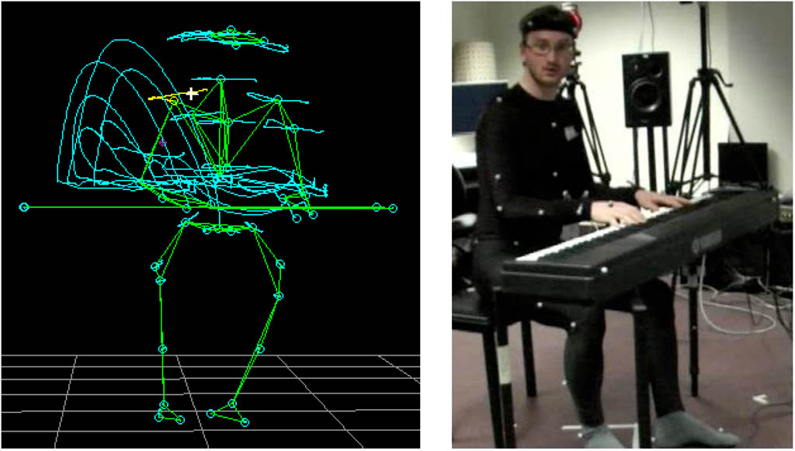
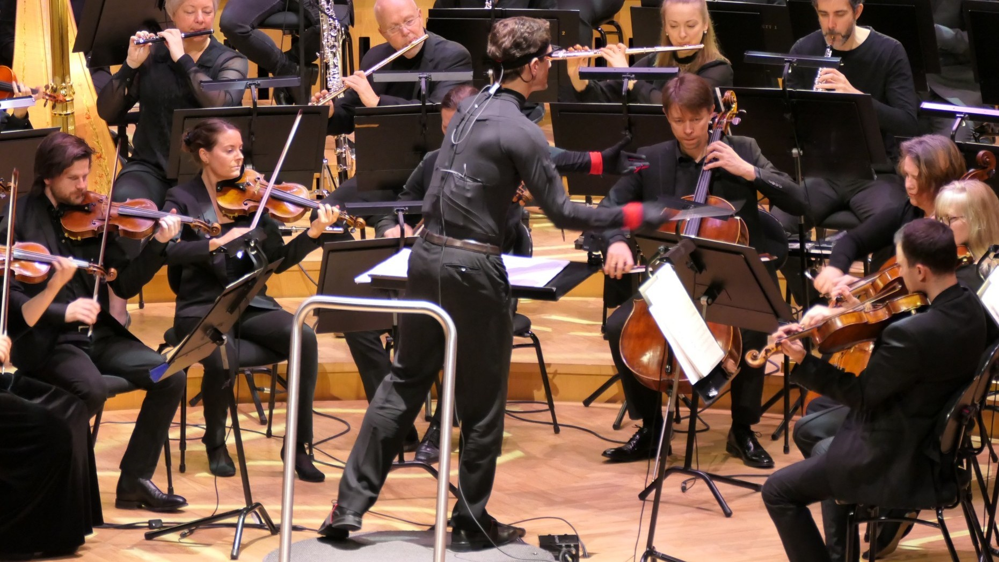

Until now, we have primarily focused on sensing sound and music as auditory experiences. While *hearing* is central, it is equally important to recognize that we also perceive sound and music through our bodies. This week, we will explore how the body shapes music perception and cognition. We will begin by examining the body's role in musical experience, then review key aspects of anatomy and biomechanics, and finally consider different methods for analyzing human movement.

## Embodied music cognition

Recall that you have been introduced to the theories of [embodied music cognition](https://fourms.github.io/sensingsoundandmusic/week1/#embodied-music-cognition) in the beginning of this course. An embodied approach to music cognition emphasizes the role of the body in producing, perceiving, and understanding music. Rather than viewing musical experience as only and auditory phenomenon&mdash;orpurely mental or abstract&mdash;this approach highlights how bodily sensations, movements, and actions are integral to musical meaning. 

Some key ideas in embodied music cognition include:

- **Sensorimotor coupling:** Listening to music frequently elicits spontaneous bodily responses&mdash;such as tapping your foot, nodding your head, or swaying&mdash;demonstrating the tight connection between perception and action. This coupling underpins the *action–perception loop*, where perceiving music can trigger movement, and movement, in turn, shapes how music is experienced. Such interactions are fundamental to musical engagement, learning, and expression.

- **Multimodal integration:** Musical experience is inherently multimodal, involving the simultaneous processing and integration of auditory (sound), visual (sight), and kinesthetic (movement and bodily sensation) information. The body acts as a central hub for these sensory streams, allowing us to coordinate what we hear, see, and feel. For example, watching a performer’s gestures can enhance our understanding of musical phrasing, while feeling vibrations or movement can deepen our sense of rhythm and timing.

- **Gesture and imagery:** Expressive body movements&mdash;ranging from large gestures to subtle motion&mdash;are essential in music performance, aiding in communication, phrasing, and emotional expression. These gestures not only shape the sound produced but also influence how performers and listeners mentally represent music. Even in the absence of overt movement, musicians and listeners often engage in *motor imagery*: mentally simulating gestures or actions associated with music, which can support learning, memory, and interpretation.

The Belgian systematic musicology professor [Marc Leman](https://research.flw.ugent.be/en/marc.leman) popularized the term embodied music cognition in the early 2000s. In a book with the same name, he made an illustration of the different processes in the bodies of both performers and perceivers. Here, he described how musical intentionality is based on sonic and visual communication between performer and perceiver:  

*An illustration of Marc Leman's model of embodied music cognition.*

Embodied music cognition is explored through multiple disciplines, including [musicology](https://en.wikipedia.org/wiki/Musicology), [psychology](https://en.wikipedia.org/wiki/Psychology), [neuroscience](https://en.wikipedia.org/wiki/Neuroscience), and [human movement science](https://en.wikipedia.org/wiki/Human_movement_science). As a result, the literature presents a variety of perspectives and methodologies. Most research in this area relies on [empirical studies](https://en.wikipedia.org/wiki/Empirical_research)&mdash;systematically collecting and analyzing data about musical experiences and bodily responses. This interdisciplinary approach enriches our understanding of how the body shapes musical perception, performance, and meaning.

### 4E Cognition

In recent years, the concept of *[4E cognition](https://en.wikipedia.org/wiki/4E_cognition)* has gained prominence, building on the "embodied turn" in cognitive science and philosophy of mind. The 4E framework—standing for [Embodied](https://en.wikipedia.org/wiki/Embodied_cognition), [Embedded](https://en.wikipedia.org/wiki/Embedded_cognition), [Enactive](https://en.wikipedia.org/wiki/Enactivism_(psychology)), and [Extended cognition](https://en.wikipedia.org/wiki/Extended_mind_thesis)—challenges traditional views that treat cognition as a process confined solely to the brain.

Pioneering researchers such as [Francisco Varela](https://en.wikipedia.org/wiki/Francisco_Varela), [Evan Thompson](https://en.wikipedia.org/wiki/Evan_Thompson), [Alva Noë](https://en.wikipedia.org/wiki/Alva_No%C3%AB), and [Andy Clark](https://en.wikipedia.org/wiki/Andy_Clark) have argued that understanding cognition requires considering the body, the environment, and the dynamic interactions between them. According to the 4E perspective, cognitive processes are:

- **Embodied:** Our perception and understanding of music are deeply rooted in the body. The way we move, breathe, and physically interact with instruments or our environment shapes how we experience and interpret sound. For example, tapping your foot to a beat or feeling vibrations through your body are embodied ways of sensing music.

- **Embedded:** Musical experience is shaped by the context in which it occurs. Our interactions with sound are influenced by the physical and social environment&mdash;such as the acoustics of a concert hall, the presence of other listeners, or the cultural setting. These factors embed our musical cognition within a broader context.

- **Enactive:** We actively participate in creating musical meaning through our actions. Listening is not passive; we anticipate, move, and respond to music, co-constructing the experience. For instance, a performer’s gestures or a listener’s dance movements are examples of enactive engagement with music.

- **Extended:** Tools and technologies can extend our cognitive processes. Musical instruments, recording devices, and even smartphones become part of the system through which we sense, produce, and understand music. Motion capture systems, for example, extend our ability to analyze and reflect on musical movement.

The 4E cognition perspective encourages us to study music as a holistic, interactive process&mdash;one that involves the whole person, situated in a specific context, engaging with both physical and digital tools.

Despite its influence, the 4E cognition framework has faced several criticisms and ongoing debates. Critics point out that the definitions of "embodied," "embedded," "enactive," and "extended" can be vague or overlapping, making it difficult to distinguish 4E cognition from traditional cognitive science in practice. Some question whether there is sufficient empirical evidence for all aspects of the framework, particularly the claim that cognition can be genuinely "extended" into tools or the environment. Others warn against overextending the concept, attributing cognitive status to objects or processes (such as smartphones or musical instruments) that may not truly participate in cognition. Additionally, some argue that 4E approaches can underplay the central role of neural mechanisms emphasized in traditional neuroscience, and philosophical disagreements persist about whether 4E cognition represents a radical shift or simply reframes existing ideas about mind, body, and environment. Nevertheless, the 4E perspective has stimulated valuable interdisciplinary discussion and inspired new research directions in music cognition and related fields.

### Performing Music

When it comes to *music-related body motion*, we can generally separate between *performers* and *perceivers*. Their roles are distinct, yet both rely on bodily processes to engage with music. Let us begin with performers. 

Music performance is inherently physical. Musicians use coordinated *[actions](https://en.wikipedia.org/wiki/Action_(philosophy))*&mdash;goal-directed and time-limited motion sequences&mdash;to produce sound, shape musical phrases, and communicate with others. The body acts as both the source and the interpreter of musical ideas, translating intention into audible and visible actions. This physicality is present in all forms of music-making, including singing, playing instruments, conducting, and dancing.

We can categorize music-related body motion in performers into four main types:

- **Sound-Producing Actions:** Movements that directly generate sound on an instrument or interface. These include selection (choosing notes or sounds), excitation (initiating sound, such as striking, plucking, or bowing), and modification (altering sound qualities like pitch or timbre). Examples: pressing piano keys, bowing a violin, or turning a synthesizer knob.

- **Sound-Facilitating Actions:** Movements that support or enhance sound production but do not themselves create sound. These include maintaining posture, shaping phrasing, and entraining the body to rhythm. Examples: a pianist’s arm movement for dynamics, a clarinetist’s breath support, or tapping a foot to keep time.

- **Sound-Accompanying Actions:** Motion that reflect or mimic musical features without producing sound. These include tracing sound contours in the air, mimicking instrumental gestures, or engaging in air performance. Examples: moving a hand upward with rising pitch, playing air guitar, or dancing to music.

- **Communicative Gestures:** Gestures intended to convey meaning, emotion, or instructions to other performers or the audience. These may be expressive, regulatory, or linguistic. Examples: a conductor’s baton movements, a nod to cue an entrance, or expressive hand gestures to convey emotion.

These categories of action and motion can be understood as existing along a continuum of connection to musical sound, as illustrated below:

*Relationship between motion and sound (Illustration: Jensenius 2022)*

While we distinguish these categories for clarity, in practice they frequently overlap and interact. For example, sound-facilitating actions are often inseparable from sound-producing actions, and performers may use communicative gestures simultaneously with playing. Recognizing this interplay is essential for a holistic understanding of music-related body motion.

### Perceiving Music

Many of the same types of actions can be found in *perceivers*, people "listening" to music. Here we use "listen" to emphasize that we experience music with our whole body, which is at the core of embodied music cognition. Perceivers also make sound during performance, whether involuntary (body sounds like breathing) or voluntary (clapping, singing along, etc.).

Music-related perceiver motion can be both voluntary and involuntary, and they play a significant role in how we experience and understand music. Examples include:

- **Dancing:** Engaging the whole body in rhythmic movement, often in response to the beat, melody, or emotional content of the music. Dance can be highly structured (as in ballroom or folk dance) or spontaneous and improvised. Dancing is a direct way for listeners to physically embody musical structure, rhythm, and emotion, and is a universal aspect of musical cultures.
- **Air performance:** Imitating the actions of playing an instrument or singing, such as "air guitar," "air drumming," or lip-syncing. These gestures reflect an embodied connection to the music and can enhance engagement and enjoyment. Air performance allows listeners to simulate the experience of being a performer, reinforcing their understanding of musical gestures and techniques.
- **Finger-tapping or foot-stamping:** Involuntarily or deliberately tapping fingers on a surface, or stamping feet to the beat or rhythm of the music. These actions are widespread, often automatic responses that help listeners synchronize with musical timing and structure. Finger-tapping, in particular, is widely used in research as a behavioral measure of beat perception and sensorimotor synchronization, providing insight into how the brain and body interact during music listening.
- **Involuntary swaying or nodding:** Subtle body motion, such as swaying or head-nodding, that occur without conscious intent. These responses are often linked to the brain's sensorimotor coupling with musical rhythm and can be observed across cultures and age groups. Such movements often arise spontaneously and reflect the deep integration of auditory and motor systems.

These bodily responses are not merely byproducts of listening—they are integral to musical perception and cognition. Moving to music can enhance memory, emotional response, and even social connection, illustrating the deep link between body and sound in musical experience.

Research shows that bodily engagement while listening to music can aid in rhythm and beat perception by helping listeners internalize and predict rhythmic patterns, making it easier to follow complex or syncopated music. Movement also enhances emotional engagement, intensifying responses such as joy, excitement, or nostalgia. Additionally, gestures and movement support learning and memory for melodies, lyrics, and rhythms, which is why movement is often used in music education. Finally, group movement—such as dancing or clapping together—facilitates social bonding by fostering a sense of unity and shared experience among listeners.

## Anatomy and Biomechanics

Before introducing different approaches to motion capture, it is essential to understand how the human body is structured and how it moves. This section provides an overview of [anatomy](https://en.wikipedia.org/wiki/Anatomy) and [biomechanics](https://en.wikipedia.org/wiki/Biomechanics) relevant to [motion analysis](https://en.wikipedia.org/wiki/Motion_analysis).

### Anatomical position and planes

Anatomy studies the structure of the body. To ensure consistency when describing locations and actions, we use the *[anatomical position](https://en.wikipedia.org/wiki/Anatomical_position)*: standing upright, head and eyes forward, arms at the sides with palms facing forward, and feet parallel and pointing ahead. 

The body is divided into regions: head, neck, trunk, upper limbs, and lower limbs, each with further subdivisions. For movement analysis, distinguishing between areas such as the arm and forearm or thigh and leg is important.

To describe positions and movements in three dimensions, we use *[anatomical planes](figures/anatomical-planes.png)*&mdash;imaginary divisions of the body.

- **Sagittal plane:** Divides the body into left and right sections (the median plane is exactly in the middle).
- **Frontal (coronal) plane:** Divides the body into front and back sections.
- **Transverse plane:** Divides the body horizontally into upper and lower parts.
To describe movement directions, the belly button (navel) is often used as a reference point for the whole body, although other anatomical landmarks may be chosen for specific body segments. Movements are typically characterized along three primary axes: medial–lateral (side-to-side or left–right), anterior–posterior (front-to-back), and superior–inferior (up–down). These axes correspond to the anatomical planes—sagittal, frontal, and transverse—and help standardize descriptions of motion in both research and clinical contexts.

### The Muscular system

The [musculoskeletal system](https://en.wikipedia.org/wiki/Musculoskeletal_system) is fundamental for producing and controlling movement, comprising two main components: the [muscular system](https://en.wikipedia.org/wiki/Muscular_system) and the [skeletal system](https://en.wikipedia.org/wiki/Skeletal_system). The muscular system consists of [muscles](https://en.wikipedia.org/wiki/Muscle) that act on the skeleton to move or position body parts, while the skeletal system includes [bones](https://en.wikipedia.org/wiki/Bone), [joints](https://en.wikipedia.org/wiki/Joint_(anatomy)), and [cartilage](https://en.wikipedia.org/wiki/Cartilage) that provide structure and protection. In the following section, we will begin by looking at the muscular system.

There are three types of muscle tissue: [cardiac](https://en.wikipedia.org/wiki/Cardiac_muscle) (heart), [smooth](https://en.wikipedia.org/wiki/Smooth_muscle) (organs), and [skeletal](https://en.wikipedia.org/wiki/Skeletal_muscle) (attached to bones). Skeletal muscles are responsible for voluntary movement.

A skeletal muscle consists of a thick, red [muscle belly](https://en.wikipedia.org/wiki/Muscle#Skeletal_muscle) and narrow, white [tendons](https://en.wikipedia.org/wiki/Tendon) at each end, which anchor the muscle to bones. When a muscle contracts, it pulls on the tendons, moving the attached bone.

Muscles can only pull, not push, so movement typically involves several muscles working together in coordinated roles. The *agonist* is the main muscle responsible for generating a specific movement, while *synergists* assist the agonist by adding force or stabilizing the origin bone (sometimes called *fixators*). In contrast, the *antagonist* produces the opposite action, allowing for controlled and smooth movement by balancing or resisting the agonist's force.

With over 600 skeletal muscles, only major superficial muscles are highlighted here:

### The Skeletal System

The adult skeleton has about 206 bones, forming the body’s framework. Bones serve as *levers* for movement and provide attachment points for muscles. Many bones have distinct *landmarks*&mdash;features that serve as sites for muscle attachment and can often be felt on your own body.

Joints are the connections between bones that allow the skeleton to move. The structure and type of each joint determine the possible directions and range of motion. Understanding joint movement is essential for analyzing how the body produces complex actions, such as those involved in music performance.

Joint movements are typically described in pairs of opposite actions, always referenced from the anatomical position:

- **Flexion** and **extension** (sagittal plane)
- **Abduction** and **adduction** (frontal plane)
- **Internal (medial) rotation** and **external (lateral) rotation** (transverse plane)

*Degrees of freedom* ([DoF](https://en.wikipedia.org/wiki/Degrees_of_freedom_(mechanics))) refer to the number of independent directions in which a joint can move. Each DoF represents a specific type of movement (e.g., flexion/extension, abduction/adduction, rotation). *Range of motion* ([RoM](https://en.wikipedia.org/wiki/Range_of_motion)) describes how far a joint can move within each DoF, typically measured in degrees Understanding DoF and RoM is essential for analyzing joint function, movement capabilities, and limitations in both everyday activities and specialized tasks like music performance.

### Biomechanics: Principles of Human Movement

*Biomechanics* is the study of how mechanical principles apply to living organisms, particularly the human body. Key areas and concepts in biomechanics include:

- **[Statics](https://en.wikipedia.org/wiki/Statics):** Examines bodies at rest or in equilibrium (e.g., standing, holding a posture).
- **[Dynamics](https://en.wikipedia.org/wiki/Dynamics_(mechanics))**: Focuses on bodies in motion (e.g., walking, playing an instrument). It can be subdivided into kinematics and kinetics. 

To analyze movement, we often refer to a *reference frame*, which provides a coordinate system for describing positions and motions. A *[global reference frame](https://en.wikipedia.org/wiki/Frame_of_reference#In_physics)* is fixed relative to the environment, such as the laboratory or stage, and serves as an external standard for measuring movement. In contrast, a *[local reference frame](https://en.wikipedia.org/wiki/Frame_of_reference#Attached_to_a_body)* is attached to a specific body segment, such as the hand relative to the forearm, allowing for the analysis of motion in relation to other parts of the body. Using both global and local reference frames enables precise and context-sensitive descriptions of human movement.

#### Kinematics

[Kinematics](https://en.wikipedia.org/wiki/Kinematics) focuses on describing motion—how body parts move—without considering the forces that cause the movement. It answers questions about *what* moves, *where*, and *how fast*.

Key concepts in kinematics include:

- **Position:** The specific location of a point or segment in space, typically given as X, Y, Z coordinates.
- **Displacement:** The straight-line change in position from the starting point to the endpoint (a vector quantity).
- **Distance:** The total length of the path traveled, regardless of direction (a scalar quantity).
- **Speed:** The rate at which an object moves, without regard to direction (scalar).
- **Velocity:** Speed in a particular direction (vector), indicating both how fast and in which direction something moves.
- **Acceleration:** The rate at which velocity changes over time, describing how quickly an object speeds up or slows down.

*The figure above shows the difference between displacement (the shortest path from start to end) and distance (the total path traveled).*

Kinematic analysis is necessary for understanding movement patterns in music performance, such as tracking the trajectory of a violinist’s bow or the hand movements of a pianist.

#### Kinetics

[Kinetics](https://en.wikipedia.org/wiki/Kinetics_(physics)) examines the forces and torques that produce or result from movement, focusing on *why* and *how* motion occurs.

Key concepts in kinetics include:

- **Force:** Any push or pull that can alter the motion of a body. Internal forces are generated by muscles, while external forces include gravity, ground reaction, and contact with objects or instruments.
- **Torque (Moment):** A rotational force that causes a body segment to rotate around a joint or axis. Muscles create torque to move limbs and control posture.
- **Power:** The rate at which work is done or energy is transferred during movement. In music performance, power is evident in actions like striking a drum or bowing a string.
- **Balance:** The ability to maintain the body’s center of mass over its base of support, both when stationary and during movement. Good balance is crucial for stable and controlled performance.
- **Center of Gravity (CoG):** The point at which the body’s mass is equally distributed in all directions. The position of the CoG changes with posture and movement.
- **Base of Support:** The area beneath the body that provides stability, typically defined by the space between the feet or points of contact with the ground.

*A person remains balanced as long as the line of gravity from their CoG falls within their base of support.*

Understanding kinetics helps analyze how musicians generate, control, and coordinate movement, as well as for preventing injury and optimizing performance.

## Motion capture

There are various ways to study human body motion. While many associate "motion capture" with suits, markers, or sensors, the term can be interpreted more broadly to include any method that systematically records human movement. This encompasses both qualitative and quantitative approaches. In practice, qualitative and quantitative methods are often combined. For example, researchers may use both video and sensors, and analyses may include both interpretive and numerical components. For clarity, this course distinguishes between qualitative and quantitative methods, but acknowledges that mixed-method approaches are common.

### Qualitative approaches

Qualitative motion analysis focuses on understanding movement through observation, reflection, and descriptive frameworks rather than numerical measurement.

- **Introspection:** Involves self-reflection on one’s own movement experiences. Musicians and researchers may evaluate their own performance, notice sensations of effort or discomfort, or describe how certain movements feel during music-making.
- **Observation:** Entails systematically watching others move—either live or via video—and annotating features of their motion. This can include noting posture, gesture, timing, and expressiveness. While some may not consider observation "proper" motion capture, it is a structured and repeatable way to document movement without specialized technology.

Observation-based methods are widely used in clinical, educational, sports, and artistic settings. The use of video recordings allows for repeated viewing, slow-motion analysis, and collaborative review, making it easier to identify subtle details and patterns.

Music researchers have been inspired by the qualitative analysis methods developed by the dancer and choreographer [Rudolf Laban](https://en.wikipedia.org/wiki/Rudolf_Laban). He developed two influential systems:

- **[Labanotation](https://en.wikipedia.org/wiki/Labanotation):** A symbolic notation system for recording and analyzing human movement, especially in dance. It uses standardized symbols to represent body parts, directions, levels, and timing, enabling detailed documentation of movement sequences.
- **[Laban Movement Analysis (LMA)](https://en.wikipedia.org/wiki/Laban_Movement_Analysis):** A comprehensive framework for describing the qualitative aspects of movement. LMA focuses on four main components: body (what moves), effort (how it moves), shape (the form the body takes), and space (where it moves). The "effort" component is particularly relevant in music, describing motion in terms of space (direct/indirect), time (quick/sustained), weight (strong/light), and flow (bound/free).

Qualitative approaches are valuable for capturing the expressive, communicative, and contextual dimensions of movement. They often complement quantitative methods by providing insights into aspects of motion that are difficult to measure numerically, such as emotion, intention, and style.

### Quantitative approaches

Quantitative methods rely on numerical representations of motion. For example, video can serve as a quantitative tool if features are extracted and measured, rather than just observed. Quantitative analysis often involves plotting measurements and applying statistical or machine learning techniques. 

We can differentiate between two main types of motion capture:

- **Camera-based motion capture:** This approach uses cameras&mdash;either standard video cameras or specialized systems (such as infrared or depth cameras)&mdash;to record and analyze movement. Markers may be placed on the body to help track specific points, or markerless systems can use computer vision algorithms to estimate body positions. Camera-based systems are widely used in biomechanics, animation, and music research because they can capture detailed, full-body motion in three dimensions. However, they often require controlled environments, careful calibration, and can be sensitive to lighting and occlusion.

- **Sensor-based motion capture:** This method relies on wearable sensors attached directly to the body. Common sensor types include inertial measurement units (IMUs), accelerometers, gyroscopes, magnetometers, and sometimes physiological sensors (such as EMG for muscle activity). Sensor-based systems are generally more portable and less dependent on the environment, making them suitable for field studies or situations where cameras are impractical. They can provide precise data on joint angles, acceleration, and orientation, but may require careful placement and calibration, and can be affected by sensor drift or interference.

Both approaches have their strengths and limitations, and the choice between them depends on the research context, required precision, and practical considerations.

Motion capture is increasingly used in music research to study the motion of performers. By tracking body motion, researchers can analyze how musicians interact with their instruments, coordinate with other performers, and express musical ideas through movement.

Key applications include:

- **Performance analysis:** Mocap helps researchers understand the biomechanics of playing instruments, such as finger, hand, and arm movements in [pianists](https://www.frontiersin.org/articles/10.3389/fpsyg.2017.00207/full) or [violinists](https://www.sciencedirect.com/science/article/pii/S0007681318300994). This can inform pedagogy, ergonomics, and injury prevention.
- **Gesture recognition:** By capturing expressive gestures, mocap enables the study of how movement relates to musical phrasing, dynamics, and emotion. See [gesture in music performance](https://en.wikipedia.org/wiki/Gesture_in_music_performance) for more background.
- **Interactive systems:** Motion data can be used to control electronic sounds or visual effects in real time, allowing for new forms of musical expression and live performance. Examples include [motion-controlled instruments](https://en.wikipedia.org/wiki/Motion-controlled_instrument) and [augmented music interfaces](https://www.nime.org/).
- **Ensemble coordination:** Mocap can reveal how musicians synchronize their movements during group performances, providing insights into [communication and timing](https://www.frontiersin.org/articles/10.3389/fpsyg.2019.00262/full) within ensembles.

Motion capture provides a powerful tool for bridging the gap between physical movement and musical expression, supporting both scientific research and creative exploration.

## Questions

1. Describe the anatomical position and explain why it is important for movement analysis.
2. What are the main differences between qualitative and quantitative approaches to human movement analysis? Provide examples of each.
3. How do camera-based and sensor-based motion capture systems differ in their applications and limitations?
4. Explain the concept of degrees of freedom in joint motion and give an example from the human body.
5. Discuss how the vestibular system contributes to balance and movement in musical performance.