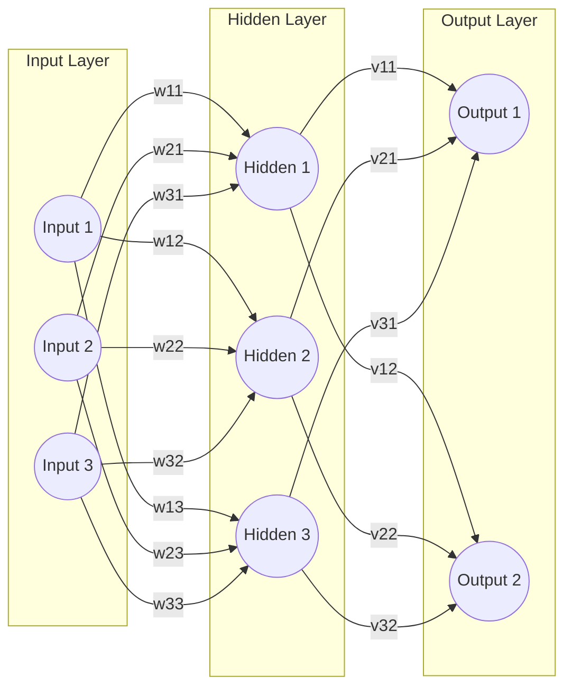
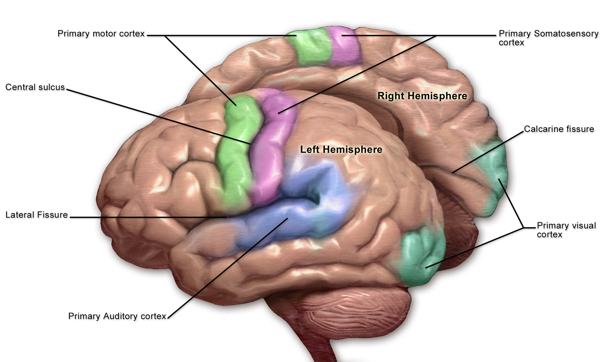

The human brain plays a central role in how we sense, interpret, and respond to sound and music. As we have discussed in previous weeks, from the moment sound waves enter our ears, intricate neural pathways are activated, allowing us to perceive pitch, rhythm, and timbre, as well as to experience emotions and memories linked to music. Understanding the brain’s involvement in sound and music cognition provides insight into the complex interplay between sensory processing, cognitive functions, and emotional responses. This week we will explore the key brain regions and mechanisms underlying our ability to make sense of sound and music, and examine the methods used to study brain activity during musical experiences.


## The Human Brain

The human brain is an extraordinarily complex organ, composed of approximately 86 billion neurons and an even greater number of supporting glial cells. Serving as the central hub for processing all sensory input, it orchestrates perception, cognition, emotion, and movement. Its remarkable plasticity enables adaptation and reorganization in response to musical training, sensory experiences, and even injury, which underlies our capacity to learn new musical skills, recover from hearing loss, and develop unique musical preferences. By integrating information from both the external world and internal states, the brain allows us to interpret, respond to, and find meaning in sound and music. The main anatomical regions of the brain include:

- **[Frontal lobe](https://en.wikipedia.org/wiki/Frontal_lobe)**: Located at the front of the brain, the frontal lobe is involved in executive functions such as decision-making, planning, problem-solving, voluntary movement, and aspects of personality and social behavior.

- **[Parietal lobe](https://en.wikipedia.org/wiki/Parietal_lobe)**: Situated behind the frontal lobe, the parietal lobe processes sensory information from the body, including touch, temperature, pain, and spatial orientation.

- **[Temporal lobe](https://en.wikipedia.org/wiki/Temporal_lobe)**: Found beneath the frontal and parietal lobes, the temporal lobe is crucial for auditory processing, language comprehension, and memory formation.

- **[Occipital lobe](https://en.wikipedia.org/wiki/Occipital_lobe)**: Located at the back of the brain, the occipital lobe is primarily responsible for visual processing.

- **[Cerebellum](https://en.wikipedia.org/wiki/Cerebellum)**: Positioned underneath the occipital lobe, the cerebellum coordinates voluntary movements, balance, posture, and motor learning.

- **[Cingulate gyrus](https://en.wikipedia.org/wiki/Cingulate_gyrus)**: Part of the limbic system, the cingulate gyrus plays a role in emotion formation and processing, learning, memory, and linking behavioral outcomes to motivation.


*Illustration of the brain's lobes ([Wikimedia Commons](https://commons.wikimedia.org/wiki/File:Gehirn,_medial_-_Lobi_en.svg)).*


```{note} 
The terms *brain* and *mind* are often used interchangeably, but they refer to different concepts. The *brain* is a physical organ made up of billions of neurons and supporting cells. The *mind* refers to the set of mental processes and experiences that arise from brain activity, including thoughts, emotions, memories, consciousness, and self-awareness. The mind is not a physical object, but rather the result of complex interactions within the brain and between the brain and the environment.
```

### Neurons

[Neurons](https://en.wikipedia.org/wiki/Neuron) are the fundamental building blocks of the brain and nervous system. These specialized cells transmit information throughout the body using both electrical and chemical signals, enabling everything from basic reflexes to complex thoughts and emotions. Each neuron consists of several main parts: the [cell body (soma)](https://en.wikipedia.org/wiki/Soma_(biology)), which contains the nucleus and essential cellular machinery; [dendrites](https://en.wikipedia.org/wiki/Dendrite), which are branch-like extensions that receive incoming signals from other neurons; and the [axon](https://en.wikipedia.org/wiki/Axon), a long projection that carries electrical impulses away from the cell body to other neurons, muscles, or glands. Communication between neurons occurs at the [synapse](https://en.wikipedia.org/wiki/Synapse), a small gap where chemical messengers called [neurotransmitters](https://en.wikipedia.org/wiki/Neurotransmitter) transmit signals from the axon terminal of one neuron to the dendrite of another.


*Illustration of a multipolar neuron ([Wikimedia Commons](https://commons.wikimedia.org/wiki/File:Blausen_0657_MultipolarNeuron.png)).*

Neuronal communication begins when dendrites receive signals from neighboring neurons. The cell body integrates these incoming signals, and if the combined input is strong enough, it generates an [action potential](https://en.wikipedia.org/wiki/Action_potential)—an electrical impulse that travels down the axon. When the action potential reaches the synapse, neurotransmitters are released, allowing the signal to be passed to the next neuron. Through these processes, neurons form intricate networks that enable the brain to process sensory information, control movement, and generate thoughts, emotions, and memories.

### Artificial neural networks

[Artificial neural networks](https://en.wikipedia.org/wiki/Neural_network_(machine_learning)) (ANNs) are computational models inspired by the structure and function of biological neurons in the brain. Just as biological neurons receive, process, and transmit information through complex networks, ANNs consist of interconnected nodes (artificial "neurons") organized in layers. Each node receives input, processes it using mathematical functions, and passes the result to nodes in the next layer.



*A simple artificial neural network with an input layer, one hidden layer, and an output layer.*

In machine learning, these networks are trained on large datasets to recognize patterns, make predictions, or classify information. The "learning" process involves adjusting the connections (weights) between nodes based on the network's performance, similar to how the brain strengthens or weakens synaptic connections through experience. Deep learning, a subset of machine learning, uses neural networks with many layers (deep neural networks) to model complex relationships in data, enabling advances in fields such as speech recognition, image analysis, and music generation.

While artificial neural networks are inspired by the brain, they are much simpler and operate differently from biological neural circuits. However, the analogy highlights how both systems can learn from experience and adapt to new information, making neural networks a powerful tool for modeling perception and cognition—including applications in sound and music analysis.


### Key brain regions for listening

Several specialized regions of the brain are crucial for processing sound and music:

- The [auditory cortex](https://en.wikipedia.org/wiki/Auditory_cortex) is located in the temporal lobe, the auditory cortex decodes basic sound features such as pitch, loudness, and timbre. It plays a central role in recognizing and interpreting musical elements.

- The [prefrontal cortex](https://en.wikipedia.org/wiki/Prefrontal_cortex) is involved in higher-order cognitive functions, including attention, pattern recognition, and the prediction of musical structure.

- The [motor cortex](https://en.wikipedia.org/wiki/Motor_cortex) can be activated even during passive listening, reflecting the brain’s response to rhythm and beat, and its role in coordinating movement.

- The [limbic system](https://en.wikipedia.org/wiki/Limbic_system) comprises structures such as the [amygdala](https://en.wikipedia.org/wiki/Amygdala) and [hippocampus](https://en.wikipedia.org/wiki/Hippocampus), the limbic system is essential for emotional responses to music and linking music to memories.

- The [nucleus accumbens](https://en.wikipedia.org/wiki/Nucleus_accumbens) i part of the brain’s reward system, this region is associated with pleasurable feelings and motivation that music can evoke.

Together, these regions enable the perception, emotional experience, and cognitive processing of sound and music.



*Motor and Sensory Regions of the Cerebral Cortex (Illustration: [Blausen Medical](https://commons.wikimedia.org/wiki/File:Blausen_0103_Brain_Sensory%26Motor.png)).*


### Auditory Pathways

As we have discussed in previous weeks, sound perception begins when sound waves enter the [outer ear](https://en.wikipedia.org/wiki/Outer_ear) and travel through the [ear canal](https://en.wikipedia.org/wiki/Ear_canal), causing the [eardrum](https://en.wikipedia.org/wiki/Eardrum) to vibrate. These vibrations are transmitted via the [ossicles](https://en.wikipedia.org/wiki/Ossicles) (tiny bones) in the [middle ear](https://en.wikipedia.org/wiki/Middle_ear) to the [cochlea](https://en.wikipedia.org/wiki/Cochlea) in the [inner ear](https://en.wikipedia.org/wiki/Inner_ear). Within the cochlea, specialized [hair cells](https://en.wikipedia.org/wiki/Hair_cell) convert mechanical vibrations into electrical signals. These signals are carried by the [auditory nerve](https://en.wikipedia.org/wiki/Cochlear_nerve) to the [brainstem](https://en.wikipedia.org/wiki/Brainstem), where they first synapse in the [cochlear nuclei](https://en.wikipedia.org/wiki/Cochlear_nucleus). From there, auditory information follows a complex, multi-stage pathway involving several key relay stations:

- The [superior olivary complex](https://en.wikipedia.org/wiki/Superior_olivary_complex) is located in the brainstem, this structure is important for processing the timing and intensity differences between the ears, which helps us localize sounds in space.
- The [inferior colliculus](https://en.wikipedia.org/wiki/Inferior_colliculus) is situated in the midbrain, the inferior colliculus integrates auditory information and is involved in reflexive responses to sound, such as orienting the head toward a noise.
- The [thalamus](https://en.wikipedia.org/wiki/Medial_geniculate_nucleus) acts as a major relay center, directing auditory signals to the appropriate regions of the cerebral cortex.

Finally, auditory information reaches the primary auditory cortex in the temporal lobe, where basic sound features such as pitch, loudness, and timbre are decoded. From here, signals are further processed in secondary auditory areas and other cortical regions, enabling the recognition of complex sounds, speech, and music.

This hierarchical and parallel processing system allows the brain to analyze multiple aspects of sound simultaneously, supporting our ability to detect, localize, and interpret the rich variety of sounds in our environment—including the intricate patterns found in music.

### Neural Processing of Sound

Once auditory information reaches the brain, specialized neural circuits decode a wide range of sound features. Within the auditory cortex, different populations of neurons are tuned to specific sound frequencies, allowing for the precise discrimination of musical notes and speech sounds:

- **Pitch**: Neurons in the primary auditory cortex are organized tonotopically, meaning they are arranged according to the frequency of sound they respond to. This organization enables the brain to distinguish between high and low pitches.
- **Loudness**: The intensity of a sound is encoded by the firing rate of auditory neurons, with louder sounds producing stronger neural responses.
- **Timbre**: The quality or color of a sound, known as timbre, is processed by integrating information from multiple frequencies and harmonics, allowing us to differentiate between instruments or voices.
- **Rhythm and Timing**: Temporal patterns in music and speech are analyzed by networks involving both the auditory cortex and motor-related areas, supporting our ability to perceive and synchronize with beats.

*Lateralization* refers to the tendency for certain auditory functions to be more dominant in one hemisphere of the brain. For example, the left hemisphere is often more specialized for processing rapid temporal changes, such as those found in speech and rhythm. This makes it crucial for language comprehension and rhythmic analysis. The right hemisphere is generally more sensitive to spectral (frequency-based) information, making it important for perceiving melody, pitch, and the emotional qualities of music. This division of labor between hemispheres enhances the brain’s ability to analyze complex sounds, such as music, by allowing parallel processing of different auditory features.

After initial feature extraction, auditory information is integrated with input from other brain regions, including the prefrontal cortex (for attention and expectation), the limbic system (for emotional response), and the motor cortex (for rhythm and motion). This integration supports higher-order processes such as recognizing familiar melodies, predicting musical structure, and associating sounds with memories or emotions.

Overall, the neural processing of sound involves a dynamic interplay between specialized brain regions, enabling us to interpret, enjoy, and respond to the rich variety of sounds and music in our environment.

### Music Cognition

Music cognition refers to the mental processes involved in understanding, interpreting, and responding to music. When we engage with music, the brain goes beyond basic sound analysis to perform complex tasks such as recognizing melodies, predicting harmonic progressions, perceiving rhythm, and recalling musical memories. Key brain regions involved in music cognition include:

- The prefrontal cortex, which supports pattern recognition, musical expectation, and the integration of musical information with attention and working memory.
- The motor cortex, which is engaged during rhythm perception and supports synchronization, beat tracking, and movement planning related to music.
- The limbic system, including the amygdala and hippocampus, which links music to emotions and autobiographical memories, contributing to the personal significance of musical experiences.
- The reward system, particularly the nucleus accumbens, which is activated during pleasurable or meaningful musical moments, reinforcing motivation and enjoyment.

These interconnected networks allow us to analyze musical structure, anticipate changes, experience emotional responses, and connect music to past experiences. Research in music cognition continues to uncover how the brain’s specialized systems work together to support our unique ability to understand and find meaning in music.

### Mirror Neurons

[Mirror neurons](https://en.wikipedia.org/wiki/Mirror_neuron) are a special class of neurons that activate both when an individual performs an action and when they observe the same action performed by others. First discovered in the premotor cortex of monkeys, mirror neurons have since been identified in humans and are thought to play a key role in understanding actions, imitation, empathy, and social cognition. In the context of music, mirror neuron systems are believed to contribute to our ability to perceive and internalize musical gestures, rhythms, and emotions. For example, when we watch a musician play an instrument or observe someone dancing, our mirror neurons may fire as if we were performing those actions ourselves. This neural mirroring supports not only learning through imitation but also the emotional and embodied experience of music, helping explain why we can "feel" the beat or empathize with a performer's expression.

```{note}
Mirror neurons were first identified in the early 1990s by a team of Italian researchers studying the brains of macaque monkeys. The discovery was serendipitous: while recording neural activity in the premotor cortex, the scientists noticed that certain neurons fired not only when the monkey performed a specific action (such as grasping an object), but also when the monkey observed a human or another monkey performing the same action. This unexpected finding revealed a new class of neurons that "mirrored" observed behaviors, leading to a surge of research into their role in action understanding, imitation, and social cognition. The accidental nature of this discovery highlights how chance observations can open up entirely new fields of neuroscience.
```
### Individual Differences

People vary widely in how they perceive and process music, with differences shaped by genetics, development, experience, and culture. Some individuals are naturally more sensitive to pitch, rhythm, or timbre, while others may possess unique abilities such as absolute pitch or heightened emotional responses to music. Musical training is a particularly influential factor, as it can enhance neural connectivity and plasticity in auditory, motor, and cognitive brain regions. Musicians often demonstrate improved auditory discrimination, better memory for musical patterns, and more efficient integration of sensory and motor information. Training can also strengthen connections between the brain’s hemispheres, supporting complex skills like reading music or improvising.

Age also affects the brain’s response to sound and music. As people grow older, changes in the auditory system and brain can lead to reduced sensitivity to certain frequencies and make it harder to distinguish speech or musical details. However, the brain’s neuroplasticity allows for compensation and adaptation, and engaging in musical activities throughout life can help maintain auditory and cognitive functions in older adults.

Neurodiversity further contributes to individual differences in music perception. For example, people with autism spectrum disorder (ASD) may process music differently, sometimes showing enhanced pitch perception or unique emotional responses. Conversely, conditions such as amusia (musical tone deafness) can limit the ability to perceive pitch or rhythm, even when hearing and intelligence are otherwise normal.

Cultural background and environmental exposure also play a significant role. Early experiences with music, language, and rhythm within a particular culture shape neural pathways and preferences, influencing how individuals perceive and appreciate unfamiliar musical styles later in life.

Overall, these individual differences highlight the brain’s remarkable adaptability. Through training, experience, and adaptation to sensory challenges, the brain continually reorganizes itself, enabling us to learn new musical skills, recover from hearing loss, and develop unique musical preferences and abilities.

## Capturing Brain Activity

Understanding how the brain processes sound and music relies on advanced methods for measuring brain activity. Several non-invasive techniques are commonly used in research and clinical settings to observe neural responses during music listening and performance. Each method offers insights into the timing, location, and nature of brain activity.

### EEG (Electroencephalography)

[Electroencephalography](https://en.wikipedia.org/wiki/Electroencephalography) (EEG) is a non-invasive technique that records the brain’s electrical activity through electrodes placed on the scalp. These electrodes detect the tiny voltage fluctuations produced by the synchronous activity of large groups of neurons, primarily in the cerebral cortex. EEG is particularly sensitive to the rapid, millisecond-scale changes in neural activity, making it an excellent tool for studying the timing and dynamics of brain responses.

In the context of music and sound research, EEG is used to investigate how the brain processes auditory information such as rhythm, pitch, melody, and harmony. For example, researchers can present musical stimuli and observe event-related potentials ([ERPs](https://en.wikipedia.org/wiki/Event-related_potential))&mdash;distinctive patterns in the EEG signal that are time-locked to specific sensory, cognitive, or motor events. This allows for the examination of processes like auditory attention, expectation, and memory in real time.

EEG is also widely used in clinical settings to diagnose neurological conditions such as epilepsy, sleep disorders, and brain injuries. In music neuroscience, it has been instrumental in exploring how musical training affects brain function, how the brain distinguishes between different musical genres, and how emotional responses to music are generated.

EEG offers several strengths, including excellent temporal resolution on the millisecond scale, non-invasiveness, relative affordability, and portability, making it suitable for a wide range of participants and experimental settings. However, it has limitations such as limited spatial resolution, which makes it difficult to pinpoint the exact sources of brain activity, and its signals primarily reflect the activity of large populations of neurons near the scalp. Additionally, EEG recordings are susceptible to artifacts caused by muscle movement or eye blinks.


*Research assistants and students are practicing EEG measurement at RITMO (Photo: UiO).*

### MEG (Magnetoencephalography)

[Magnetoencephalography](https://en.wikipedia.org/wiki/Magnetoencephalography) (MEG) is a non-invasive neuroimaging technique that measures the tiny magnetic fields produced by synchronized electrical activity in groups of neurons, primarily in the cerebral cortex. Unlike EEG, which detects voltage changes on the scalp, MEG captures the magnetic signals generated by neural currents, providing a direct window into brain function with high temporal precision.

MEG is especially valuable for studying the timing and localization of brain processes involved in sound and music perception. Its millisecond-level temporal resolution allows researchers to track the rapid neural dynamics underlying auditory processing, rhythm perception, and musical imagery. MEG can also map functional connectivity&mdash;how different brain regions communicate during musical tasks&mdash;by analyzing the synchronization of neural activity across the cortex.

In music neuroscience, MEG has been used to investigate how the brain distinguishes between different musical elements, how musicians anticipate and synchronize with rhythm, and how emotional responses to music unfold over time. Its ability to localize sources of brain activity more accurately than EEG makes it a powerful tool for exploring the spatial organization of auditory and cognitive functions.

MEG offers several strengths, including excellent temporal resolution on the millisecond scale, good spatial resolution, and the ability to directly measure neural activity in a non-invasive manner. It is particularly well-suited for mapping functional connectivity between brain regions. However, MEG also has notable limitations: it is expensive, requires a magnetically shielded room to prevent interference, is less portable and more sensitive to movement than EEG or fNIRS, and is generally less accessible due to the specialized equipment needed.


*MEG instrument used for recording magnetic fields generated by brain activity (Photo: [Very Big Brain](https://verybigbrain.com/outside-influences/magnetoencephalography-meg-a-cutting-edge-tool-for-studying-brain-dynamics/)).*

### fMRI (Functional Magnetic Resonance Imaging)

[Functional Magnetic Resonance Imaging](https://en.wikipedia.org/wiki/Functional_magnetic_resonance_imaging) (fMRI) is a non-invasive neuroimaging technique that measures brain activity by detecting changes in blood flow, specifically the Blood Oxygen Level Dependent (BOLD) signal. When a brain region becomes more active, it consumes more oxygen, leading to localized changes in blood oxygenation that fMRI can detect. This allows researchers to create detailed maps of neural activity across the entire brain.

fMRI is widely used in music neuroscience to identify which brain areas are engaged during music listening, performance, and imagination. It has revealed how networks involved in auditory perception, emotion, memory, and motor planning are activated by music. For example, fMRI studies have shown that listening to music can engage not only the auditory cortex but also limbic regions (linked to emotion), the prefrontal cortex (involved in attention and expectation), and motor areas (related to rhythm and movement).

While fMRI provides excellent spatial resolution&mdash;allowing precise localization of brain activity&mdash;it has lower temporal resolution compared to EEG or MEG, as the hemodynamic response unfolds over several seconds. The scanning environment is also noisy and requires participants to remain very still, which can limit the types of musical tasks that can be studied.

fMRI offers several strengths, including high spatial resolution on the millimeter scale, whole-brain coverage, and non-invasive measurement, making it widely available in research settings and highly effective for mapping complex brain networks. However, it also has notable limitations: its temporal resolution is lower (on the order of seconds), it is sensitive to head motion, the scanning environment is noisy and confined, and the technique is expensive. Additionally, fMRI is not suitable for all populations, such as individuals with metal implants or people with claustrophobia.


*Example of an fMRI scan (Image: [Wikimedia Commons](https://commons.wikimedia.org/wiki/File:190603_Functional_magnetic_resonance_imaging_at_the_Imperial_Centre_for_Psychedelic_Research.jpg)).*

### fNIRS (Functional Near-Infrared Spectroscopy)

[Functional Near-Infrared Spectroscopy](https://en.wikipedia.org/wiki/Functional_near-infrared_spectroscopy) (fNIRS) is a non-invasive imaging technique that uses near-infrared light to monitor changes in blood oxygenation and blood volume in the cortex, which are indirect indicators of neural activity. By placing light sources and detectors on the scalp, fNIRS measures how much near-infrared light is absorbed by oxygenated and deoxygenated hemoglobin in the brain. When a brain region becomes more active, it consumes more oxygen, leading to detectable changes in the optical properties of the tissue.

fNIRS is particularly valuable for studying brain function in situations where other imaging methods may be impractical. Its silent operation and tolerance for movement make it ideal for research with infants, children, and musicians performing on instruments, as well as for experiments conducted in more naturalistic or real-world environments. For example, fNIRS has been used to investigate how children process music, how musicians' brains respond during live performance, and how social interactions influence neural activity during group music-making.

fNIRS offers several strengths, including portability, relative affordability, silent operation, and tolerance for movement, making it suitable for a wide range of participants and experimental settings, such as developmental and ecological studies. However, it is limited to measuring activity in cortical (surface) brain regions, has lower spatial resolution compared to fMRI, and cannot access deep brain structures.


*Victoria Johnson performing with an fNIRS system during the event [MusicLab Brain: Inside the mind of a violinist](https://www.uio.no/ritmo/english/projects/musiclab/2024/brain/) in 2024 (Photo: UiO).*

### Comparison of Brain Activity Measurement Methods

These complementary methods&mdash;EEG, fNIRS, MEG, and fMRI&mdash;allow researchers to investigate how the brain responds to sound and music, from the millisecond timing of neural events to the identification of specific brain regions involved in perception, cognition, and emotion.

| Method | Strengths | Limitations |
|--------|-----------|-------------|
| **EEG** | Excellent temporal resolution (milliseconds); non-invasive; affordable; portable; suitable for diverse participants and settings | Limited spatial resolution; signals mainly from surface neurons; susceptible to artifacts (e.g., muscle movement, eye blinks) |
| **fNIRS** | Portable; affordable; silent; tolerant of movement; suitable for developmental and ecological studies | Limited to cortical (surface) regions; lower spatial resolution than fMRI; cannot access deep brain structures |
| **MEG** | Excellent temporal resolution; good spatial resolution; direct measurement of neural activity; non-invasive; suitable for mapping connectivity | High cost; requires magnetically shielded room; less portable; sensitive to movement; limited accessibility |
| **fMRI** | High spatial resolution (millimeters); whole-brain coverage; non-invasive; widely available; effective for mapping complex networks | High cost; lower temporal resolution (seconds); sensitive to head movement; noisy/confined environment; not suitable for all populations |


## Brain-Computer Interfaces

Brain-computer interfaces (BCIs) are systems that enable direct communication between the brain and external devices, bypassing traditional pathways such as muscles or speech. In the context of sound and music, BCIs have a range of applications that leverage the brain’s neural activity to control or enhance auditory experiences.

### Applications

- **Brain-Computer Interfaces for Music**: BCIs can allow users to create or control music using their brain signals. For example, EEG-based BCIs have been developed that let individuals compose melodies, trigger musical events, or modulate sound parameters through imagined movement or focused attention. These technologies open new possibilities for musical expression, especially for people with physical disabilities.

- **Hearing Aids**: Modern hearing aids increasingly incorporate signal processing techniques that adapt to the user’s environment. Research is exploring how BCIs can further improve hearing aids by detecting the user’s auditory attention&mdash;helping the device focus on the sound source the listener wants to hear, such as a specific voice in a noisy room.

- **Cochlear Implants**: Cochlear implants are medical devices that restore hearing by directly stimulating the auditory nerve in individuals with severe hearing loss. Advances in neuroscience and brain-computer interfacing are leading to smarter implants that can adapt to the user’s neural responses, potentially improving sound quality and speech comprehension.

These applications demonstrate how understanding and harnessing brain activity can enhance auditory perception, communication, and creative expression. As technology advances, BCIs and neuroprosthetic devices are likely to play an increasingly important role in both clinical and artistic domains related to sound and music.

## Questions

1. What are the main differences between EEG, MEG, fMRI, and fNIRS in terms of how they measure brain activity and their strengths and limitations?
2. How do the auditory cortex, prefrontal cortex, motor cortex, limbic system, and nucleus accumbens each contribute to the perception and experience of music?
3. In what ways do individual differences such as musical training, age, neurodiversity, and cultural background influence how the brain processes music?
4. What role do mirror neurons play in music perception and why are they important for understanding musical gestures and emotions?
5. How can brain-computer interfaces (BCIs) be used in music creation, hearing aids, and cochlear implants to enhance auditory experiences?